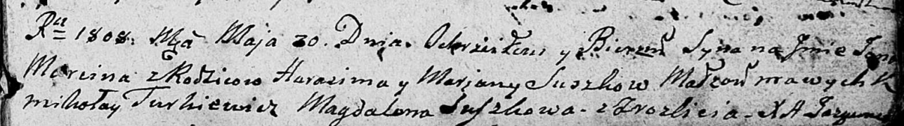

**Сушко Ян Гарасимов (Suszko Jan Marcin)**

30 мая 1808 г -- крещение (НИАБ 136-13-894, лист 65, №21/1808-р (ориг)).

**НИАБ 136-13-894:** Лист 65. **Метрическая запись №21/1808-р (ориг).**

{width="6.496527777777778in"
height="0.9138987314085739in"}

Дедиловичская Покровская церковь. 30 мая 1808 года. Метрическая запись о
крещении.

Suszko Jan Marcin -- сын родителей с деревни Разлитье.

Suszko Harasim -- отец.

Suszkowa Marjana -- мать.

Turkiewicz Mikołay -- кум.

Suszkowa Magdalena -- кума.

Jazgunowicz Antoni -- ксёндз.
