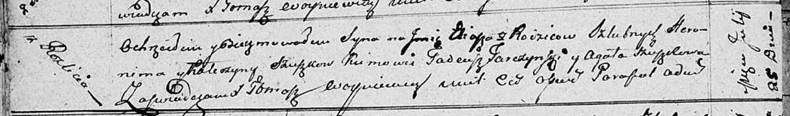

**Сушко Катерына (Suszkowa Katerzyna)**

25 июля 1811 г -- крещение сына Ильи (НИАБ 136-13-894, лист 81об,
№36/1811-р (ориг)).

**НИАБ 136-13-894:** Лист 81об. **Метрическая запись №36/1811-р
(ориг).**

{width="6.496527777777778in"
height="0.9581528871391076in"}

Осовская Покровская церковь. 25 июля 1811 года. Метрическая запись о
крещении.

Szuszko Eliasz -- сын родителей с деревни Разлитье.

Szuszko Heronim -- отец.

Szuszkowa Katerzyna -- мать.

Tarczynski Tadeusz -- кум.

Szuszkowa Agata -- кума.

Woyniewicz Tomasz -- ксёндз.
