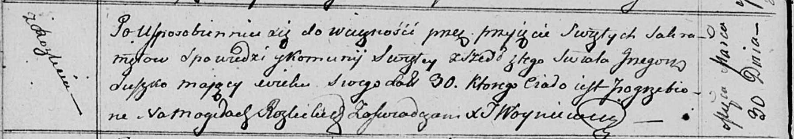

**Сушко Грыгор (Suszko Hryhor, Grzegorz)**

6 ноября 1804 г -- венчание с Настасьей Чапляй с деревни Осово (НИАБ
136-13-920, лист 10об, №7/1804-б (ориг)).

30 марта 1813 г -- отпевание, умер в возрасте 30 лет (родился около 1783
г) (НИАБ 136-13-919, лист 26об, №31/1813-у (ориг)).

**НИАБ 136-13-920:** Лист 10об. **Метрическая запись №7/1804-б (ориг).**

Дедиловичская Покровская церковь. 6 ноября 1804 года. Метрическая запись
о венчании.

Suszko Hryhor -- жених, молодой, с деревни Разлитье.

Czapłajowna Nastazya -- невеста, с деревни Осовo.

Suszko Karp -- свидетель.

Skakun Cimachwiey -- свидетель.

Jazgunowicz Antoni -- ксёндз.

**НИАБ 136-13-920:** Лист 26об. **Метрическая запись №31/1813-у
(ориг).**

Осовская униатская церковь. 30 марта 1813 года. Метрическая запись об
отпевании.

Suszko Grzegorz -- умерший, 30 лет, с деревни Разлитье, похоронен на
кладбище деревни Разлитье.

Woyniewicz Tomasz -- ксёндз.
