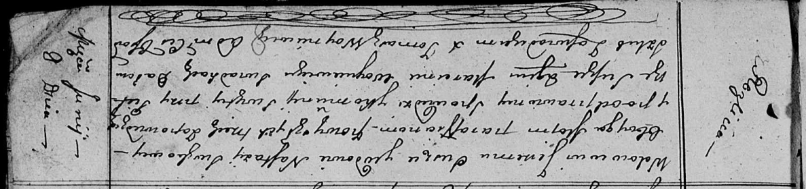

**Сушко Ерема (Suszko Jerema)**

8 июня 1813 г -- венчание с вдовой Настасьей Сушко с деревни Разлитье
(НИАБ 136-13-920, лист 19, №7/1813-б (ориг)).

**НИАБ 136-13-920:** Лист 19. **Метрическая запись №7/1813-б (ориг).**

Осовская Покровская церковь. 8 июня 1813 года. Запись о венчании.

Suszko Jerema -- жених, вдовец, парафии Осовской, с деревни Разлитье.

Suszkowa Nastazya -- невеста, вдова, парафии Осовской, с деревни
Разлитье.

Suszko Piotr -- свидетель.

Woyniewicz Marcin -- свидетель.

Woyniewicz Tomasz -- ксёндз.
