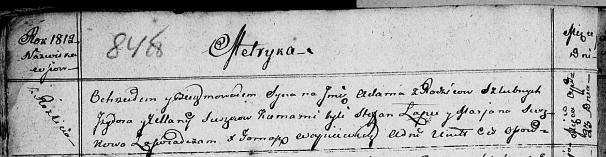

**Сушко Адам Изыдоров (Suszko Adam)**

23 апреля 1812 г -- крещение (НИАБ 136-13-894, лист 84об, №25/1812-р
(ориг)).

**НИАБ 136-13-894:** Лист 84об. **Метрическая запись №25/1812-р
(ориг).**

Осовская Покровская церковь. 23 апреля 1812 года. Метрическая запись о
крещении.

Suszko Adam -- сын родителей с деревни Разлитье.

Suszko Jzydor -- отец.

Suszkowa Ullana -- мать.

Łapieć Stefan -- кум.

Suszkowa Marjana -- кума.

Woyniewicz Tomasz -- ксёндз.
