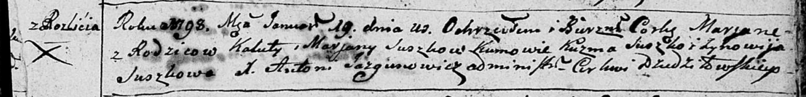

**Сушко Ева Калютова (Suszkowna Ewa)**

14 октября 1795 г -- крещение (НИАБ 136-13-894, лист 25об, №43/1795-р
(ориг)).

**НИАБ 136-13-894:** Лист 25об. **Метрическая запись №43/1795-р
(ориг).**

{width="6.496527777777778in"
height="1.443597987751531in"}

Дедиловичская Покровская церковь. 14 октября 1795 года. Метрическая
запись о крещении.

Łukaszewiczowna Ewa -- дочь родителей с деревни Разлитье.

Łukaszewicz Kaluta -- отец.

Łukaszewiczowa Marjana -- мать.

Suszko Andrzey - кум.

Suszkowa Ewdokija - кума.

Jazgunowicz Antoni -- ксёндз.
