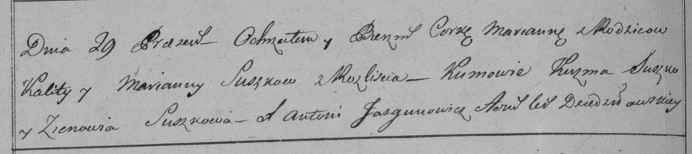

**Сушко Марьяна Калютова (Suszkowna Marjana)**

19 января 1798 г -- крещение (НИАБ 136-13-894, лист 36, №28/1798-р
(ориг)), (РГИА 823-2-18, лист 264об, №28/1798-р (коп)).

**НИАБ 136-13-894:** Лист 36. **Метрическая запись №28/1798-р (ориг).**

Дедиловичская Покровская церковь. 19 января 1798 года. Метрическая
запись о крещении.

Suszkowna Marjana -- дочь родителей с деревни Разлитье.

Suszko Kaluta -- отец.

Suszkowa Marjana -- мать.

Suszko Kużma - кум.

Suszkowa Zynowija - кума.

Jazgunowicz Antoni -- ксёндз.

**РГИА 823-2-18:** Лист 264об. **Метрическая запись №28/1798-р (коп).**

Дедиловичская Покровская церковь. \[19 января\] 1798 года. Метрическая
запись о крещении.

Suszkowna Marianna -- дочь родителей с деревни Разлитье.

Suszko Kalist -- отец.

Suszkowa Marianna -- мать.

Suszko Kuzma -- кум.

Suszkowa Zienowia -- кума.

Jazgunowicz Antoni -- ксёндз.
