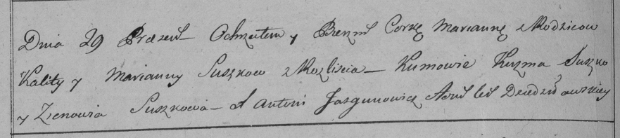

**Сушко Марьяна (Suszkowa Marjana)**

14 октября 1795 г -- крещение дочери Евы (НИАБ 136-13-894, лист 25об,
№43/1795-р (ориг)).

19 января 1798 г -- крещение дочери Марьяны (НИАБ 136-13-894, лист 36,
№28/1798-р (ориг)), (РГИА 823-2-18, лист 264об, №28/1798-р (коп)).

1 января 1800 г -- крестная мать Ксени, дочери Сушков Андрея и Анны с
деревни Разлитье (НИАБ 136-13-894, лист 40, №2/1800-р (ориг)).

1 января 1802 г -- крестная мать Елены Мелании, дочери Сушков Андрея И
Агапы с деревни Осово (НИАБ 136-13-894, лист 45, №1/1802-р (ориг)).

26 декабря 1803 -- возможно, крестная мать Степана Яна, сына Сушков
Изыдора и Ульяны с деревни Разлитье (НИАБ 136-13-894, лист 52об,
№49/1803-р (ориг)).

**НИАБ 136-13-894:** Лист 25об. **Метрическая запись №43/1795-р
(ориг).**

{width="6.496527777777778in"
height="1.443597987751531in"}

Дедиловичская Покровская церковь. 14 октября 1795 года. Метрическая
запись о крещении.

Łukaszewiczowna Ewa -- дочь родителей с деревни Разлитье.

Łukaszewicz Kaluta -- отец.

Łukaszewiczowa Marjana -- мать.

Suszko Andrzey - кум.

Suszkowa Ewdokija - кума.

Jazgunowicz Antoni -- ксёндз.

**НИАБ 136-13-894:** Лист 36. **Метрическая запись №28/1798-р (ориг).**

{width="6.496527777777778in"
height="0.7911964129483815in"}

Дедиловичская Покровская церковь. 19 января 1798 года. Метрическая
запись о крещении.

Suszkowna Marjana -- дочь родителей с деревни Разлитье.

Suszko Kaluta -- отец.

Suszkowa Marjana -- мать.

Suszko Kużma - кум.

Suszkowa Zynowija - кума.

Jazgunowicz Antoni -- ксёндз.

**РГИА 823-2-18:** Лист 264об. **Метрическая запись №28/1798-р (коп).**

{width="6.496527777777778in"
height="1.4527777777777777in"}

Дедиловичская Покровская церковь. \[19 января\] 1798 года. Метрическая
запись о крещении.

Suszkowna Marianna -- дочь родителей с деревни Разлитье.

Suszko Kalist -- отец.

Suszkowa Marianna -- мать.

Suszko Kuzma -- кум.

Suszkowa Zienowia -- кума.

Jazgunowicz Antoni -- ксёндз.

**НИАБ 136-13-894:** Лист 40. **Метрическая запись №2/1800-р (ориг).**

{width="6.496527777777778in"
height="1.2618908573928258in"}

Дедиловичская Покровская церковь. 1 января 1800 года. Метрическая запись
о крещении.

Suszkowna Xienia -- дочь.

Suszko Andrzey -- отец.

Suszkowa Anna -- мать.

Suszko Karp -- кум, с деревни Разлитье.

Suszkowa Marjana -- кума, с деревни Разлитье.

Jazgunowicz Antoni -- ксёндз.

**НИАБ 136-13-894:** Лист 45об. **Метрическая запись №1/1802-р (ориг).**

{width="6.496527777777778in"
height="1.980003280839895in"}

Дедиловичская Покровская церковь. 1 января \[1802\] года. Метрическая
запись о крещении.

Suszkowna Elena Mełania -- дочь родителей с деревни Осовo.

Suszko Andrzey -- отец.

Suszkowa Ahapa -- мать.

Suszko Karp -- кум.

Suszkowa Maryia -- кума, с деревни Разлитье.

Jazgunowicz Antoni -- ксёндз.

**НИАБ 136-13-894:** Лист 52об. **Метрическая запись №49/1803-р
(ориг).**

{width="6.496527777777778in"
height="2.2730139982502187in"}

Дедиловичская Покровская церковь. 26 декабря 1803 года. Метрическая
запись о крещении.

Suszko Stefan Jan -- сын родителей с деревни Разлитье.

Suszko Jzydor -- отец.

Suszkowa Ullana -- мать.

Łapać Stefan -- кум, с деревни Разлитье.

Suszkowa Marjana -- кума, с деревни Разлитье.

Jazgunowicz Antoni -- ксёндз.
