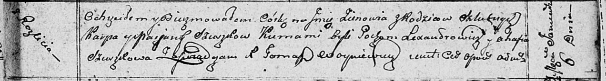

**Сушко Зеновия Карпова (Szuszkowa Zienowia)**

6 января 1811 г -- крещение (НИАБ 136-13-894, лист 80, №3/1811-р
(ориг)).

**НИАБ 136-13-894:** Лист 80. **Метрическая запись №3/1811-р (ориг).**

Осовская Покровская церковь. 6 января 1811 года. Метрическая запись о
крещении.

Szuszkowna Zienowia -- дочь родителей с деревни Разлитье.

Szuszko Karp -- отец.

Szuszkowa Marjana -- мать.

Lexandrowicz Pochom -- кум.

Szuszkowa Ahafia -- кума.

Woyniewicz Tomasz -- ксёндз.
