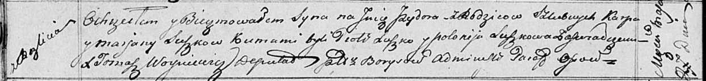

**Сушко Изыдор Карпов (Suszko Jzydor)**

27 мая 1817 г -- крещение (НИАБ 136-13-894, лист 96об, №37/1817-р
(ориг)).

**НИАБ 136-13-894:** Лист 96об. **Метрическая запись №37/1817-р
(ориг).**

Осовская Покровская церковь. 27 мая 1817 года. Метрическая запись о
крещении.

Suszko Jzydor -- сын родителей с деревни Разлитье.

Suszko Karp -- отец.

Suszkowa Marjana -- мать.

Suszko Piotr -- кум.

Suszkowa Połonija -- кума.

Woyniewicz Tomasz -- ксёндз.
