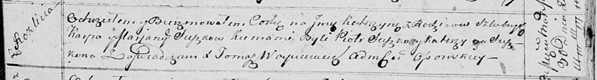

**Сушко Катерына Карпова (Suszkowna Katerzyna)**

30 марта 1814 г -- крещение (НИАБ 136-13-894, лист 89, №18/1814-р
(ориг)).

**НИАБ 136-13-894:** Лист 89. **Метрическая запись №18/1814-р (ориг).**

{width="6.496527777777778in"
height="0.8823851706036745in"}

Осовская Покровская церковь. 30 марта 1814 года. Метрическая запись о
крещении.

Suszkowna Katerzyna -- сын родителей с деревни Разлитье.

Suszko Karp -- отец.

Suszkowa Marjana -- мать.

Suszko Piotr -- кум.

Suszkowa Katerzyna -- кума.

Woyniewicz Tomasz -- ксёндз.
