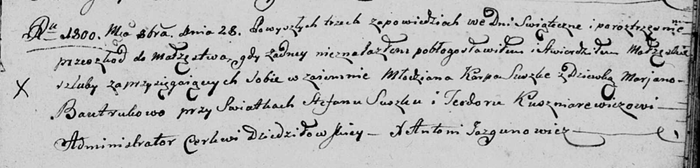
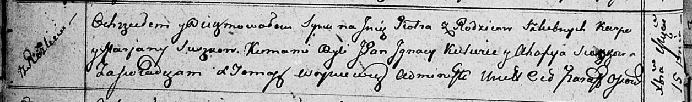
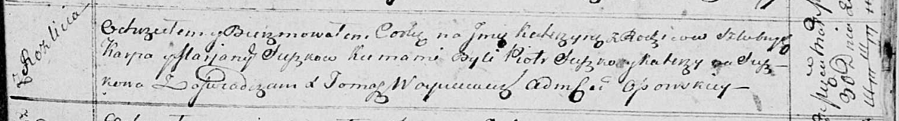
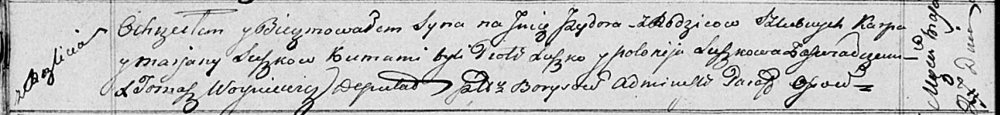
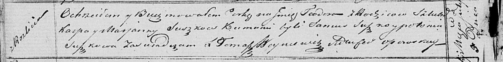

**Сушко (Бавтрук) Марьяна (Suszkowa, Szuszkowa Marjana z Bautrukow)**

28 октября 1800 г -- венчание с молодым Карпом Сушко с деревни Разлитье
(НИАБ 136-13-920, лист 7, №5/1800-б (ориг), НИАБ 136-13-949, лист 107об,
№5/1800-б (коп)).

16 марта 1802 г -- крещение сына Александра Антона (НИАБ 136-13-894,
лист 46, №11/1802-р (ориг)).

26 декабря 1803 -- возможно, крестная мать Степана Яна, сына Сушков
Изыдора и Ульяны с деревни Разлитье (НИАБ 136-13-894, лист 52об,
№49/1803-р (ориг)).

19 июня 1804 г -- крещение сына Хомы Антона (НИАБ 136-13-894, лист 53об,
№17/1804-р (ориг)).

6 января 1811 г -- крещение дочери Зеновии (НИАБ 136-13-894, лист 80,
№3/1811-р (ориг)).

15 декабря 1812 г -- крещение сына Петра (НИАБ 136-13-894, лист 85об,
№58/1812-р (ориг)).

30 марта 1814 г -- крещение дочери Катерыны (НИАБ 136-13-894, лист 89,
№18/1814-р (ориг)).

27 мая 1817 г -- крещение сына Изыдора (НИАБ 136-13-894, лист 96об,
№37/1817-р (ориг)).

5 июля 1821 г -- крещение дочери Тодоры (НИАБ 136-13-894, лист 106об,
№30/1821-р (ориг)).

**НИАБ 136-13-920:** Лист 7. **Метрическая запись №5/1800-б (ориг).**

Дедиловичская Покровская церковь. 28 октября 1800 года. Метрическая
запись о венчании.

Suszko Karp -- жених, молодой, с деревни \[Разлитье\].

Bautrukowa Marjana -- невеста, девка.

Suszko Stefan -- свидетель.

Kuszniarewicz Teodor -- свидетель.

Jazgunowicz Antoni -- ксёндз.

**НИАБ 136-13-949:** Лист 107об. **Метрическая запись №5/1800-б (коп).**

(См. тж.: НИАБ 136-13-920, лист 7, №5/1800-б (ориг))

Дедиловичская Покровская церковь. 28 октября 1800 года. Метрическая
запись о венчании.

Suszko Karp -- жених, молодой, с деревни \[Разлитье\].

Bautrukowa Marjana -- невеста, девка.

Suszko Stefan -- свидетель, с деревни Разлитье.

Kuszniarewicz Teodor -- свидетель, с деревни Дедиловичи.

Jazgunowicz Antoni -- ксёндз.

**НИАБ 136-13-894:** Лист 46. **Метрическая запись №11/1802-р (ориг).**

Дедиловичская Покровская церковь. 16 марта 1802 года. Метрическая запись
о крещении.

Suszko Alexander Antoni -- сын родителей с деревни Разлитье.

Suszko Karp -- отец.

Suszkowa Marjana -- мать.

Suszko Mikołay -- кум, с деревни Горелое.

Suszkowa Ahapa -- кума, с деревни Разлитье.

Jazgunowicz Antoni -- ксёндз.

**НИАБ 136-13-894:** Лист 52об. **Метрическая запись №49/1803-р
(ориг).**

Дедиловичская Покровская церковь. 26 декабря 1803 года. Метрическая
запись о крещении.

Suszko Stefan Jan -- сын родителей с деревни Разлитье.

Suszko Jzydor -- отец.

Suszkowa Ullana -- мать.

Łapać Stefan -- кум, с деревни Разлитье.

Suszkowa Marjana -- кума, с деревни Разлитье.

Jazgunowicz Antoni -- ксёндз.

**НИАБ 136-13-894:** Лист 53об. **Метрическая запись №17/1804-р
(ориг).**

Дедиловичская Покровская церковь. 19 июня 1804 года. Метрическая запись
о крещении.

\[Suszko\] Tomasz Antoni -- сын родителей с деревни Разлитье.

\[Suszko\] Karp -- отец.

\[Suszkowa\] Marjana -- мать.

Suszko Mikołay -- кум, с деревни Разлитье.

Suszkowa Ahafija -- кума, с деревни Разлитье.

Jazgunowicz Antoni -- ксёндз.

**НИАБ 136-13-894:** Лист 80. **Метрическая запись №3/1811-р (ориг).**

Осовская Покровская церковь. 6 января 1811 года. Метрическая запись о
крещении.

Szuszkowna Zienowia -- дочь родителей с деревни Разлитье.

Szuszko Karp -- отец.

Szuszkowa Marjana -- мать.

Lexandrowicz Pochom -- кум.

Szuszkowa Ahafia -- кума.

Woyniewicz Tomasz -- ксёндз.

**НИАБ 136-13-894:** Лист 85об. **Метрическая запись №58/1812-р
(ориг).**

Осовская Покровская церковь. 15 декабря 1812 года. Метрическая запись о
крещении.

Suszko Piotr -- сын родителей с деревни Разлитье.

Suszko Karp -- отец.

Suszkowa Marjana -- мать.

Kulwiec Jgnacy, JP -- кум, шляхтич.

Suszkowa Ahafija -- кума.

Woyniewicz Tomasz -- ксёндз.

**НИАБ 136-13-894:** Лист 89. **Метрическая запись №18/1814-р (ориг).**

Осовская Покровская церковь. 30 марта 1814 года. Метрическая запись о
крещении.

Suszkowna Katerzyna -- сын родителей с деревни Разлитье.

Suszko Karp -- отец.

Suszkowa Marjana -- мать.

Suszko Piotr -- кум.

Suszkowa Katerzyna -- кума.

Woyniewicz Tomasz -- ксёндз.

**НИАБ 136-13-894:** Лист 96об. **Метрическая запись №37/1817-р
(ориг).**

Осовская Покровская церковь. 27 мая 1817 года. Метрическая запись о
крещении.

Suszko Jzydor -- сын родителей с деревни Разлитье.

Suszko Karp -- отец.

Suszkowa Marjana -- мать.

Suszko Piotr -- кум.

Suszkowa Połonija -- кума.

Woyniewicz Tomasz -- ксёндз.

**НИАБ 136-13-894:** Лист 106об. **Метрическая запись №30/1821-р
(ориг).**

Осовская Покровская церковь. 5 июля 1821 года. Метрическая запись о
крещении.

Suszkowna Teodora -- дочь родителей с деревни Разлитье.

Suszko Karp -- отец.

Suszkowa Marjana -- мать.

Suszko Samuś -- кум.

Suszkowa Połonija -- кума.

Woyniewicz Tomasz -- ксёндз.
