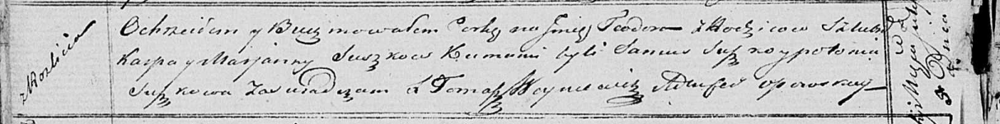

**Сушко Тодора Карпова (Suszkowna Teodora)**

5 июля 1821 г -- крещение (НИАБ 136-13-894, лист 106об, №30/1821-р
(ориг)).

**НИАБ 136-13-894:** Лист 106об. **Метрическая запись №30/1821-р
(ориг).**

Осовская Покровская церковь. 5 июля 1821 года. Метрическая запись о
крещении.

Suszkowna Teodora -- дочь родителей с деревни Разлитье.

Suszko Karp -- отец.

Suszkowa Marjana -- мать.

Suszko Samuś -- кум.

Suszkowa Połonija -- кума.

Woyniewicz Tomasz -- ксёндз.
