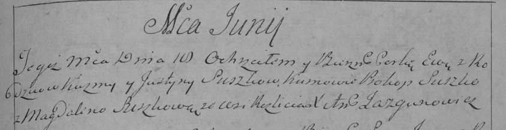

**Сушко Ева Кузьмова (Suszkowna Ewa)**

18 июня 1794 г -- крещение (НИАБ 136-13-894, лист 22, №24/1794-р
(ориг)), (РГИА 823-2-18, лист 250, №15/1794-р (коп)).

**НИАБ 136-13-894:** Лист 22. **Метрическая запись №24/1794-р (ориг).**

{width="6.496527777777778in"
height="0.8086297025371828in"}

Дедиловичская Покровская церковь. 18 июня 1794 года. Метрическая запись
о крещении.

Suszkowna Ewa -- дочь родителей с деревни Разлитье.

Suszko Kuzma -- отец.

Suszkowa Justa -- мать.

Suszko Prokop - кум.

Suszkowa Magdalena - кума.

Jazgunowicz Antoni -- ксёндз.

**РГИА 823-2-18:** Лист 250. **Метрическая запись №15/1794-р (коп).**

{width="6.496527777777778in"
height="1.6701388888888888in"}

Дедиловичская Покровская церковь. 18 июня 1794 года. Метрическая запись
о крещении.

Suszkowna Ewa -- дочь родителей с деревни Разлитье.

Suszko Kuzma -- отец.

Suszkowa Justyna -- мать.

Suszko Prokop -- кум.

Suszkowa Magdalena -- кума.

Jazgunowicz Antoni -- ксёндз.
