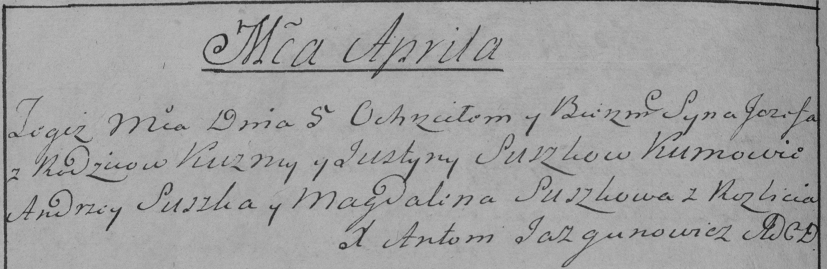

**Сушко Иосиф Кузьмов (Suszko Jozef)**

5 апреля 1786 г -- крещение (РГИА 832-2-18, лист 231об, №11/1786-р
(ориг)).

**РГИА 832-2-18:** Лист 231об. **Метрическая запись №11/1786-р (коп).**

{width="6.496527777777778in"
height="2.1131944444444444in"}

Дедиловичская Покровская церковь. 5 апреля 1786 года. Метрическая запись
о крещении.

Suszko Jozef -- сын родителей с деревни Разлитье.

Suszko Kuzma -- отец.

Suszkowa Justyna -- мать.

Suszko Andrzey -- кум.

Suszkowa Magdalena - кума.

Jazgunowicz Antoni -- ксёндз.
