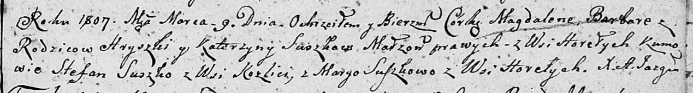

**Сушко Степан Кузьмов (Suszko Stefan)**

9 марта 1791 г -- крещение (НИАБ 136-13-894, лист 12об, №8/1791-р
(ориг)).

9 марта 1807 г -- возможно, крестный отец Магдалены Барбары, дочери
Сушков Григорыя и Катерыны с деревни Горелое (НИАБ 136-13-894, лист 62,
№14/1807-р (ориг)).

**НИАБ 136-13-894:** Лист 12об. **Метрическая запись №8/1791-р (ориг).**

{width="6.496527777777778in"
height="0.8669641294838145in"}

Дедиловичская Покровская церковь. 9 марта 1791 года. Метрическая запись
о крещении.

Suszko Stefan -- сын родителей с деревни Разлитье.

Suszko Kuzma -- отец.

Suszkowa Justyna -- мать.

Suszko Prokop - кум.

Suszkowa Magdalena - кума.

Jazgunowicz Antoni -- ксёндз.

**НИАБ 136-13-894:** Лист 62. **Метрическая запись №14/1807-р (ориг).**

{width="6.496527777777778in"
height="0.8803740157480315in"}

Дедиловичская Покровская церковь. 9 марта 1807 года. Метрическая запись
о крещении.

Suszkowna Magdalena Barbara -- дочь родителей с деревни Горелое.

Suszko Hryszka -- отец.

Suszkowa Katerzyna -- мать.

Suszko Stefan -- кум, с деревни Разлитье.

Suszkowa Marya -- кума, с деревни Горелое.

Jazgunowicz Antoni -- ксёндз.
