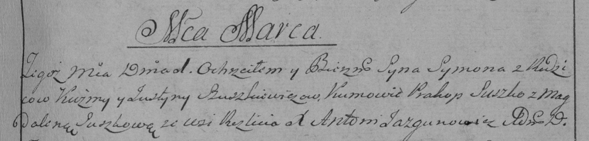

**Сушко Сымон Кузьмов (Suszko, Suszkiewicz Symon)**

1 марта 1796 г -- крещение (НИАБ 136-13-894, лист 28, №25/1796-р
(ориг)), (РГИА 823-2-18, лист 255, №10/1796-р (коп)).

Лист 28. **Метрическая запись №25/1796-р (ориг).**

{width="6.496527777777778in"
height="1.0238615485564304in"}

Дедиловичская Покровская церковь. 1 марта 1796 года. Метрическая запись
о крещении.

Suszkiewicz Symon -- сын родителей с деревни Разлитье.

Suszkiewicz Kuzma -- отец.

Suszkiewiczowa Justyna -- мать.

Suszko Prakop - кум.

Suszkowa Magdalena - кума.

Jazgunowicz Antoni -- ксёндз.

**РГИА 823-2-18:** Лист 255. **Метрическая запись №10/1796-р (коп).**

{width="6.496527777777778in"
height="1.5597222222222222in"}

Дедиловичская Покровская церковь. 1 марта 1796 года. Метрическая запись
о крещении.

Szuszkiewicz Symon -- сын родителей с деревни Разлитье.

Szuszkiewicz Kuźma -- отец.

Szuszkiewiczowa Justyna -- мать.

Suszko Prakop -- кум.

Suszkowa Magdalena -- кума.

Jazgunowicz Antoni -- ксёндз.
