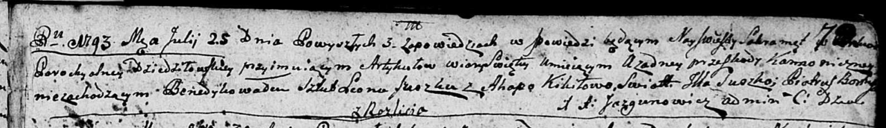

**Сушко (Кикило) Агапа (Suszkowa Ahapa z Kikiłow)**

25 июля 1793 г -- венчание с Леоном Сушко с деревни Разлитье (НИАБ
136-13-894, лист 72, №4/1793-б (ориг)).

**НИАБ 136-13-894:** Лист 72. **Метрическая запись №4/1793-б (ориг).**

{width="6.496527777777778in"
height="0.9474245406824147in"}

Дедиловичская Покровская церковь. 25 июля 1793 года. Метрическая запись
о венчании.

Suszko Leon -- жених, с деревни Разлитье.

Kikiłowa Ahapa -- невеста.

Suszko Jlla -- свидетель.

Boutruk? Piatruś -- свидетель.

Jazgunowicz Antoni -- ксёндз.
