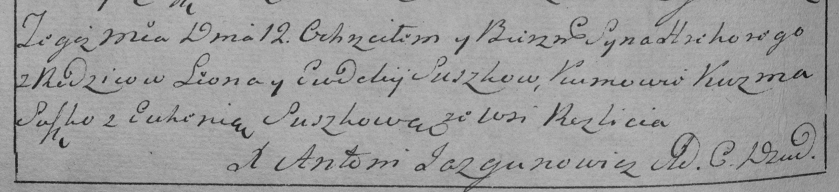

**Сушко Евдокия (Suszkowa Ewdokija)**

12 февраля 1792 г -- крещение сына Грыгорыя (НИАБ 136-13-894, лист 15,
№7/1792-р (ориг)), (См. тж.: РГИА 823-2-18, лист 243об, №3/1792-р
(коп)).

**НИАБ 136-13-894:** Лист 15. **Метрическая запись №7/1792-р (ориг).**

{width="6.496527777777778in"
height="0.8783617672790901in"}

Дедиловичская Покровская церковь. 12 февраля 1792 года. Метрическая
запись о крещении.

Suszko Hrehory -- сын родителей с деревни Разлитье.

Suszko Leon -- отец.

Suszkowa Ewdokija -- мать.

Suszko Kuzma -- кум.

Suszkowa Euhenija - кума.

**РГИА 823-2-18:** Лист 243об. **Метрическая запись №3/1792-р (коп).**

{width="6.496527777777778in"
height="1.4868055555555555in"}

Дедиловичская Покровская церковь. 12 января 1792 года. Метрическая
запись о крещении.

Suszko Hrehory -- сын родителей с деревни Разлитье.

Suszko Leon -- отец.

Suszkowa Eudokija -- мать.

Suszko Kuzma -- кум.

Suszkowa Euhenia - кума.

Jazgunowicz Antoni -- ксёндз.
