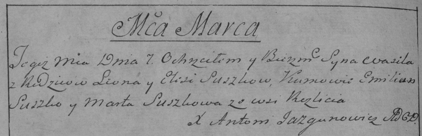

**Сушко Василь Леонов младший (Suszko Wasil)**

29 декабря 1790 г -- крещение (НИАБ 136-13-894, лист 12, №91/1790-р
(ориг)).

**НИАБ 136-13-894:** Лист 12. **Метрическая запись №91/1790-р (ориг).**

{width="6.496527777777778in"
height="0.682574365704287in"}

Дедиловичская Покровская церковь. 29 декабря 1790 года. Метрическая
запись о крещении.

Suszko Wasil -- сын родителей с деревни Разлитье.

Suszko Leon -- отец.

Suszkowa Elesia -- мать.

Suszko Dziamid - кум.

Suszkowa Daryia - кума.

Jazgunowicz Antoni -- ксёндз.
