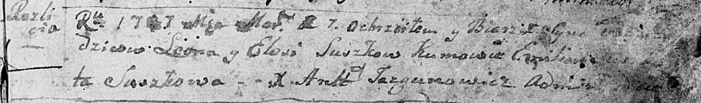

**Сушко Василь Леонов (Suszko Wasil)**

7 марта 1787 г -- крещение сына (НИАБ 136-13-894, лист 1, №6/1787-р
(ориг)), (РГИА 823-2-18, лист 233об, №.7/1787-р (коп)).

**НИАБ 136-13-894:** Лист 1. **Метрическая запись №6/1787-р (ориг).**

Дедиловичская Покровская церковь. 1 марта 1787 года. Метрическая запись
о крещении.

Suszko - сын родителей с деревни Разлитье.

Suszko Leon -- отец.

Suszkowa Elesia -- мать.

Suszko Emilian -- кум.

Suszkowa \...ta - кума.

Jazgunowicz Antoniusz -- ксёндз.

**РГИА 823-2-18:** Лист 233об. **Метрическая запись №7/1787-р (коп).**

Дедиловичская Покровская церковь. 7 марта 1787 года. Метрическая запись
о крещении.

Suszko Wasil -- сын родителей с деревни Разлитье.

Suszko Leon -- отец.

Suszkowa Elesia -- мать.

Suszko Emilian -- кум.

Suszkowa Marta - кума.

Jazgunowicz Antoni -- ксёндз.
