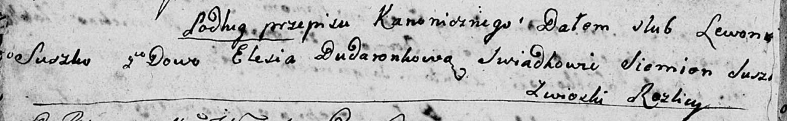
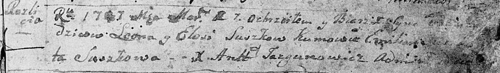
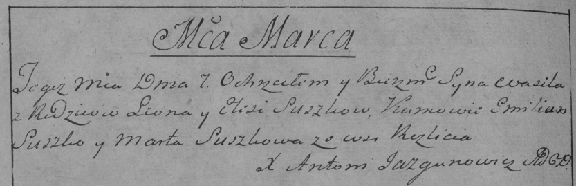
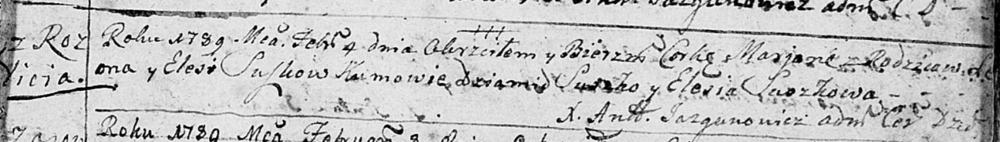
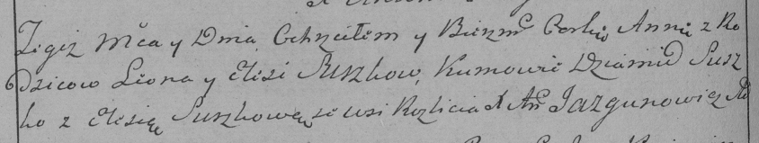
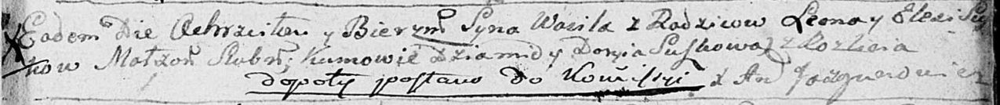
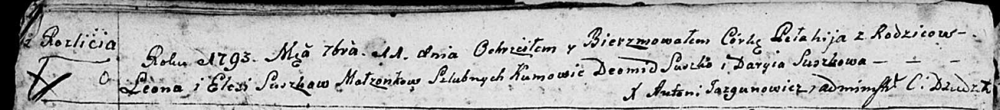

**Сушко (в первом браке Дударёнок) Елеся (Suszkowa Elesia)**

2 февраля 1788 г -- венчание с Леоном Сушко (НИАБ 136-13-894, лист 66об,
№4/1788-б (ориг)).

7 марта 1787 г -- крещение сына Василя (НИАБ 136-13-894, лист 1,
№6/1787-р (ориг)), (РГИА 823-2-18, лист 233об, №.7/1787-р (коп)).

4 февраля 1789 г -- крещение дочери Марьяны (НИАБ 136-13-894, лист 6,
№7/1789-р (ориг)), (РГИА 823-2-18, лист 237об, №6/1789-р (коп)).

29 декабря 1790 г -- крещение сына Василя (НИАБ 136-13-894, лист 12,
№91/1790-р (ориг)).

11 сентября 1793 г -- крещение дочери Пелагии (НИАБ 136-13-894, лист
20об, №65/1793-р (ориг)).

**НИАБ 136-13-894:** Лист 66об. **Метрическая запись №4/1788-б (ориг).**

Дедиловичская Покровская церковь. 2 февраля 1788 года. Метрическая
запись о венчании.

Suszko Lewon -- жених, с деревни Разлитье.

Dudaronkowa Elesia -- невеста, вдова.

Suszko Siemion -- свидетель.

Jazgunowicz Antoni -- ксёндз.

**НИАБ 136-13-894:** Лист 1. **Метрическая запись №6/1787-р (ориг).**

Дедиловичская Покровская церковь. 1 марта 1787 года. Метрическая запись
о крещении.

Suszko - сын родителей с деревни Разлитье.

Suszko Leon -- отец.

Suszkowa Elesia -- мать.

Suszko Emilian -- кум.

Suszkowa \...ta - кума.

Jazgunowicz Antoniusz -- ксёндз.

**РГИА 823-2-18:** Лист 233об. **Метрическая запись №7/1787-р (коп).**

Дедиловичская Покровская церковь. 7 марта 1787 года. Метрическая запись
о крещении.

Suszko Wasil -- сын родителей с деревни Разлитье.

Suszko Leon -- отец.

Suszkowa Elesia -- мать.

Suszko Emilian -- кум.

Suszkowa Marta - кума.

Jazgunowicz Antoni -- ксёндз.

**НИАБ 136-13-894:** Лист 6. **Метрическая запись №7/1789-р (ориг).**

Дедиловичская Покровская церковь. 4 февраля 1789 года. Метрическая
запись о крещении.

Suszkowna Marjana -- дочь родителей с деревни Разлитье.

Suszko Leon -- отец.

Suszkowa Elesia -- мать.

Suszko Dziamid - кум.

Suszkowa Elesia - кума.

Jazgunowicz Antoni -- ксёндз.

**РГИА 823-2-18:** Лист 237об. **Метрическая запись №6/1789-р (коп).**

Дедиловичская Покровская церковь. 4 февраля 1789 года. Метрическая
запись о крещении.

Suszkowna Anna -- дочь родителей с деревни Разлитье.

Suszko Leon -- отец.

Suszko Elesia -- мать.

Suszko Dziamid -- кум.

Suszkowa Elesia - кума.

Jazgunowicz Antoni -- ксёндз.

**НИАБ 136-13-894:** Лист 12. **Метрическая запись №91/1790-р (ориг).**

Дедиловичская Покровская церковь. 29 декабря 1790 года. Метрическая
запись о крещении.

Suszko Wasil -- сын родителей с деревни Разлитье.

Suszko Leon -- отец.

Suszkowa Elesia -- мать.

Suszko Dziamid - кум.

Suszkowa Daryia - кума.

Jazgunowicz Antoni -- ксёндз.

Лист 20-об. **Метрическая запись №65/1793-р (ориг).**

Дедиловичская Покровская церковь. 11 сентября 1793 года. Метрическая
запись о крещении.

Suszkowna Pełahija -- дочь родителей с деревни Разлитье.

Suszko Leon -- отец.

Suszkowa Elesia-- мать.

Suszko Deomid - кум.

Suszkowa Daryia - кума.

Jazgunowicz Antoni -- ксёндз.
