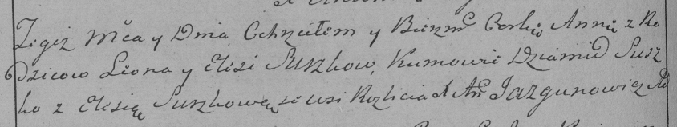

**Сушко Марьяна Леонова (Suszkowna Marjana)**

4 февраля 1789 г -- крещение (НИАБ 136-13-894, лист 6, №7/1789-р
(ориг)), (РГИА 823-2-18, лист 237об, №6/1789-р (коп)).

**НИАБ 136-13-894:** Лист 6. **Метрическая запись №7/1789-р (ориг).**

Дедиловичская Покровская церковь. 4 февраля 1789 года. Метрическая
запись о крещении.

Suszkowna Marjana -- дочь родителей с деревни Разлитье.

Suszko Leon -- отец.

Suszkowa Elesia -- мать.

Suszko Dziamid - кум.

Suszkowa Elesia - кума.

Jazgunowicz Antoni -- ксёндз.

**РГИА 823-2-18:** Лист 237об. **Метрическая запись №6/1789-р (коп).**

Дедиловичская Покровская церковь. 4 февраля 1789 года. Метрическая
запись о крещении.

Suszkowna Anna -- дочь родителей с деревни Разлитье.

Suszko Leon -- отец.

Suszko Elesia -- мать.

Suszko Dziamid -- кум.

Suszkowa Elesia - кума.

Jazgunowicz Antoni -- ксёндз.
