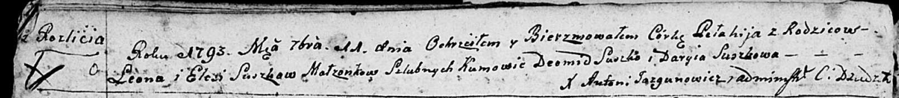

**Сушко Пелагия Леонова (Suszkowna Pełahija)**

11 сентября 1793 г -- крещение (НИАБ 136-13-894, лист 20об, №65/1793-р
(ориг)).

Лист 20-об. **Метрическая запись №65/1793-р (ориг).**

{width="6.496527777777778in"
height="0.7174409448818898in"}

Дедиловичская Покровская церковь. 11 сентября 1793 года. Метрическая
запись о крещении.

Suszkowna Pełahija -- дочь родителей с деревни Разлитье.

Suszko Leon -- отец.

Suszkowa Elesia-- мать.

Suszko Deomid - кум.

Suszkowa Daryia - кума.

Jazgunowicz Antoni -- ксёндз.
