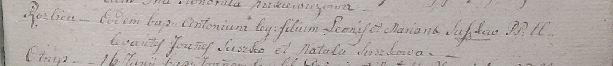

**Сушко Марьяна (Suszkowa Mariana)**

5 июня 1799 г -- крещение сына Антония (НИАБ 1781-27-199, лист 128,
№29/1799-р).

**НИАБ 1781-27-199:** Лист 128. **Метрическая запись №29/1799-р.**

Дедиловичский костел Наисвятейшего Сердца Иисуса. 5 июня 1799 года.
Метрическая запись о крещении.

Suszko Antoni -- сын крестьян с деревни Разлитье.

Suszko Leon -- отец.

Suszkowa Mariana -- мать.

Suszko Joannes -- крестный отец.

Suszkowa Natala -- крестная мать.

Linhart Hyacinthus -- ксёндз.
