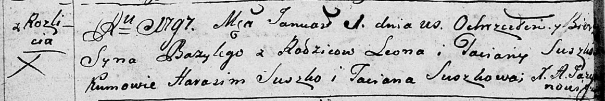
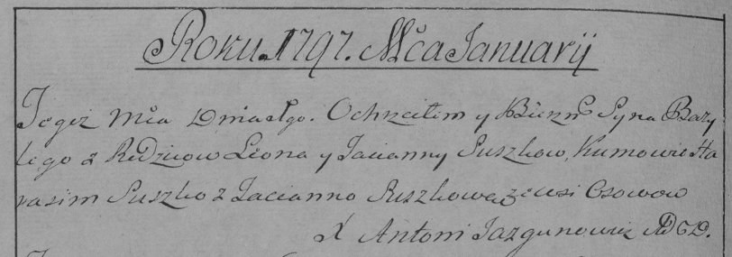

**Сушко Базыль Леонов (Suszko Bazyli)**

1 января 1797 г -- крещение (НИАБ 136-13-894, лист 31об, №1/1797-р
(ориг)), (РГИА 823-2-18, лист 258об, №1/1797-р (коп)).

**НИАБ 136-13-894:** Лист 31-об. **Метрическая запись №1/1797-р
(ориг).**

Дедиловичская Покровская церковь. 1 января 1797 года. Метрическая запись
о крещении.

Suszko Bazyli -- сын родителей с деревни Разлитье.

Suszko Leon -- отец.

Suszkowa Taciana -- мать.

Suszko Harasim - кум.

Suszkowa Taciana - кума.

Jazgunowicz Antoni -- ксёндз.

**РГИА 823-2-18:** Лист 258об. **Метрическая запись №1/1797-р (коп).**

Дедиловичская Покровская церковь. 1 января 1797 года. Метрическая запись
о крещении.

Suszko Bazyli -- сын родителей с деревни \[Разлитье\].

Suszko Leon -- отец.

Suszkowa Tacianna -- мать.

Suszko Harasim -- кум.

Suszkowa Tacianna -- кума.

Jazgunowicz Antoni -- ксёндз.
