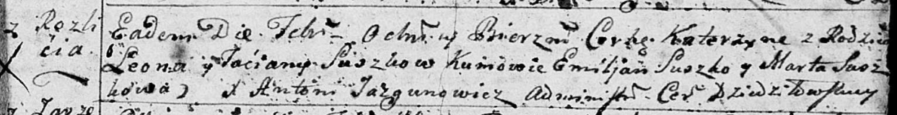

**Сушко Катерина Леонова (Suszkowna Katerzyna)**

27 февраля 1793 г -- крещение (НИАБ 136-13-894, лист 19, №27/1793-р
(ориг)).

**НИАБ 136-13-894:** Лист 19. **Метрическая запись №27/1793-р (ориг).**

Дедиловичская Покровская церковь. 27 февраля 1793 года. Метрическая
запись о крещении.

Suszkowna Katerzyna -- дочь родителей с деревни Разлитье.

Suszko Leon -- отец.

Suszkowa Taćiana -- мать.

Suszko Emiljan - кум.

Suszkowa Marta - кума.

Jazgunowicz Antoni -- ксёндз.
