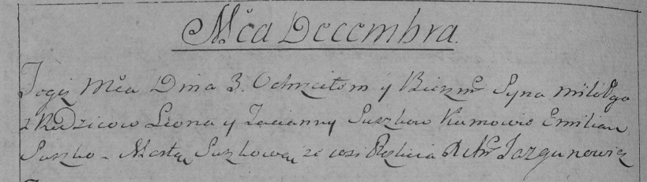
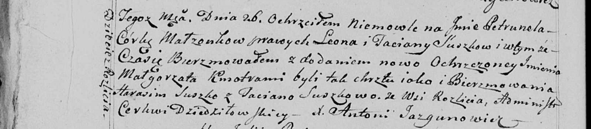
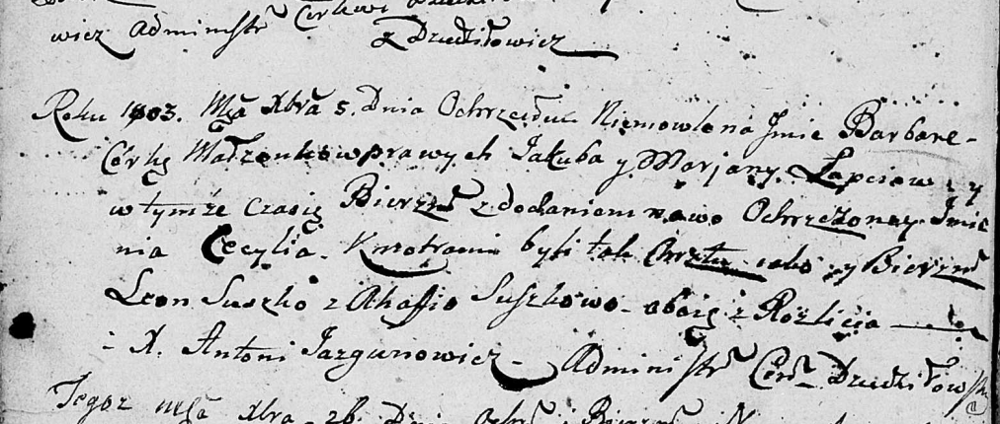

**Сушко Леон (Suszko, Suszkiewicz Leon)**

18 мая 1791 г -- венчание с Татьяной Игнатович (НИАБ 136-13-894, лист
70, №13/1791-б (ориг)).

27 февраля 1793 г -- крещение дочери Катерины (НИАБ 136-13-894, лист 19,
№27/1793-р (ориг)).

3 декабря 1794 г -- крещение сына Миколая (НИАБ 136-13-894, лист 23об,
№59/1794-р (ориг)), (РГИА 823-2-18, лист 251об, №41/1794-р (коп)).

1 января 1797 г -- крещение сына Базыля (НИАБ 136-13-894, лист 31об,
№1/1797-р (ориг)), (РГИА 823-2-18, лист 258об, №1/1797-р (коп)).

26 июня 1799 г -- крещение дочери Петрунели (НИАБ 136-13-894, лист 39,
№25/1799-р (ориг), НИАБ 136-13-938, лист 242об, №24/1799-р (коп)).

5 декабря 1803 г -- возможно, крестный отец Барбары Цецылии, дочери
Лапецов Якуба и Марьяны с деревни Дедиловичи (НИАБ 136-13-894, лист
52об, №48/1803-р (ориг)).

**НИАБ 136-13-894:** Лист 70. **Метрическая запись №13/1791-б (ориг).**

Дедиловичская Покровская церковь. 18 мая 1791 года. Метрическая запись о
венчании.

Suszkiewicz Leon -- жених, с деревни Разлитье.

Jhnatowiczowna Taćiana -- невеста.

Suszko Łukjan -- свидетель.

Suszko Łukjan -- свидетель.

Suszko Sciepan -- свидетель.

Jazgunowicz Antoni -- ксёндз.

**НИАБ 136-13-894:** Лист 19. **Метрическая запись №27/1793-р (ориг).**

Дедиловичская Покровская церковь. 27 февраля 1793 года. Метрическая
запись о крещении.

Suszkowna Katerzyna -- дочь родителей с деревни Разлитье.

Suszko Leon -- отец.

Suszkowa Taćiana -- мать.

Suszko Emiljan - кум.

Suszkowa Marta - кума.

Jazgunowicz Antoni -- ксёндз.

**НИАБ 136-13-894:** Лист 23об. **Метрическая запись №59/1794-р
(ориг).**

Дедиловичская Покровская церковь. 3 декабря 1794 года. Метрическая
запись о крещении.

Suszko Mikołay -- сын родителей с деревни Разлитье.

Suszko Leon -- отец.

Suszkowa Taciana -- мать.

Suszko Emilian - кум.

Suszkowa Marta - кума.

Jazgunowicz Antoni -- ксёндз.

**РГИА 823-2-18:** Лист 251об. **Метрическая запись №41/1794-р (коп).**

Дедиловичская Покровская церковь. 3 декабря 1794 года. Метрическая
запись о крещении.

Suszko Mikołay -- сын родителей с деревни Разлитье.

Suszko Leon -- отец.

Suszkowa Tacianna -- мать.

Suszko Emilian -- кум.

Suszkowa Marta -- кума.

Jazgunowicz Antoni -- ксёндз.

**НИАБ 136-13-894:** Лист 31-об. **Метрическая запись №1/1797-р
(ориг).**

Дедиловичская Покровская церковь. 1 января 1797 года. Метрическая запись
о крещении.

Suszko Bazyli -- сын родителей с деревни Разлитье.

Suszko Leon -- отец.

Suszkowa Taciana -- мать.

Suszko Harasim - кум.

Suszkowa Taciana - кума.

Jazgunowicz Antoni -- ксёндз.

**РГИА 823-2-18:** Лист 258об. **Метрическая запись №1/1797-р (коп).**

Дедиловичская Покровская церковь. 1 января 1797 года. Метрическая запись
о крещении.

Suszko Bazyli -- сын родителей с деревни \[Разлитье\].

Suszko Leon -- отец.

Suszkowa Tacianna -- мать.

Suszko Harasim -- кум.

Suszkowa Tacianna -- кума.

Jazgunowicz Antoni -- ксёндз.

**НИАБ 136-13-894:** Лист 39. **Метрическая запись №25/1799-р (ориг).**

Дедиловичская Покровская церковь. 26 июня 1799 года. Метрическая запись
о крещении.

Suszkowna Petrunela -- дочь родителей с деревни Разлитье.

Suszko Leon -- отец.

Suszkowa Taciana -- мать.

Suszko Harasim -- кум.

Suszkowa Taciana -- кума.

Jazgunowicz Antoni -- ксёндз.

**НИАБ 136-13-938:** Лист 242об. **Метрическая запись №24/1799-р
(коп).**

(См. тж. НИАБ 136-13-894, лист 39, №25/1799-р (ориг)

Дедиловичская Покровская церковь. 26 июня 1799 года. Метрическая запись
о крещении.

Suszkowna Petrunela Małgorzata -- дочь родителей с деревни Дедиловичи
\[Разлитье\].

Suszko Leon -- отец.

Suszkowa Taciana -- мать.

Suszko Harasim -- кум.

Suszkowa Taciana - кума, с деревни Разлитье.

Jazgunowicz Antoni -- ксёндз.

**НИАБ 136-13-894:** Лист 52об. **Метрическая запись №48/1803-р
(ориг).**

Дедиловичская Покровская церковь. 5 декабря 1803 года. Метрическая
запись о крещении.

Łapciowna Barbara Cecylia -- дочь родителей с деревни Дедиловичи.

Łapać Jakub -- отец.

Łapciowa Marjana -- мать.

Suszko Leon -- кум, с деревни Разлитье.

Suszkowa Ahafija -- кума, с деревни Разлитье.

Jazgunowicz Antoni -- ксёндз.
