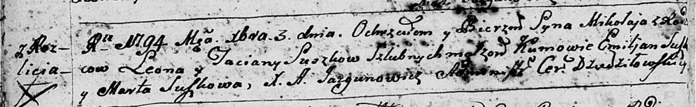

**Сушко Миколай Леонов (Suszko Mikołay)**

3 декабря 1794 г -- крещение (НИАБ 136-13-894, лист 23об, №59/1794-р
(ориг)), (РГИА 823-2-18, лист 251об, №41/1794-р (коп)).

Лист 23об. **Метрическая запись №59/1794-р (ориг).**

Дедиловичская Покровская церковь. 3 декабря 1794 года. Метрическая
запись о крещении.

Suszko Mikołay -- сын родителей с деревни Разлитье.

Suszko Leon -- отец.

Suszkowa Taciana -- мать.

Suszko Emilian - кум.

Suszkowa Marta - кума.

Jazgunowicz Antoni -- ксёндз.

**РГИА 823-2-18:** Лист 251об. **Метрическая запись №41/1794-р (коп).**

Дедиловичская Покровская церковь. 3 декабря 1794 года. Метрическая
запись о крещении.

Suszko Mikołay -- сын родителей с деревни Разлитье.

Suszko Leon -- отец.

Suszkowa Tacianna -- мать.

Suszko Emilian -- кум.

Suszkowa Marta -- кума.

Jazgunowicz Antoni -- ксёндз.
