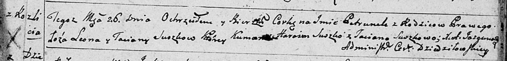
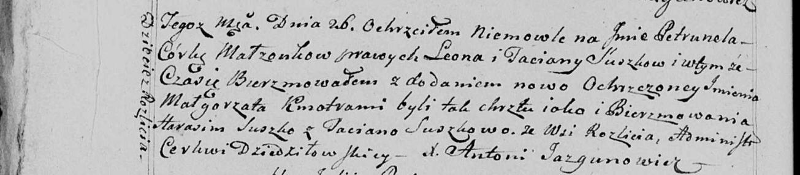

**Сушко Петрунеля Леонова (Suszkowna Petrunela)**

26 июня 1799 г -- крещение (НИАБ 136-13-894, лист 39, №25/1799-р (ориг),
НИАБ 136-13-938, лист 242об, №24/1799-р (коп)).

**НИАБ 136-13-894:** Лист 39. **Метрическая запись №25/1799-р (ориг).**

Дедиловичская Покровская церковь. 26 июня 1799 года. Метрическая запись
о крещении.

Suszkowna Petrunela -- дочь родителей с деревни Разлитье.

Suszko Leon -- отец.

Suszkowa Taciana -- мать.

Suszko Harasim -- кум.

Suszkowa Taciana -- кума.

Jazgunowicz Antoni -- ксёндз.

**НИАБ 136-13-938:** Лист 242об. **Метрическая запись №24/1799-р
(коп).**

(См. тж. НИАБ 136-13-894, лист 39, №25/1799-р (ориг)

Дедиловичская Покровская церковь. 26 июня 1799 года. Метрическая запись
о крещении.

Suszkowna Petrunela Małgorzata -- дочь родителей с деревни Дедиловичи
\[Разлитье\].

Suszko Leon -- отец.

Suszkowa Taciana -- мать.

Suszko Harasim -- кум.

Suszkowa Taciana - кума, с деревни Разлитье.

Jazgunowicz Antoni -- ксёндз.
