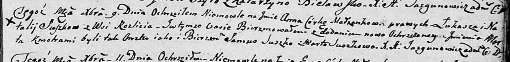

**Сушко Лукаш (Suszko Łukasz)**

9 декабря 1804 г -- крещение дочери Анны Марты (НИАБ 136-13-894, лист
56, №59/1804-р (ориг)).

**НИАБ 136-13-894:** Лист 56. **Метрическая запись №59/1804-р (ориг).**

Дедиловичская Покровская церковь. 9 декабря 1804 года. Метрическая
запись о крещении.

Suszkowna Anna Marta -- дочь родителей с деревни Разлитье.

Suszko Łukasz -- отец.

Suszkowa Natalla -- мать.

Suszko Samuś -- кум.

Suszkowa Marta -- кума.

Jazgunowicz Antoni -- ксёндз.
