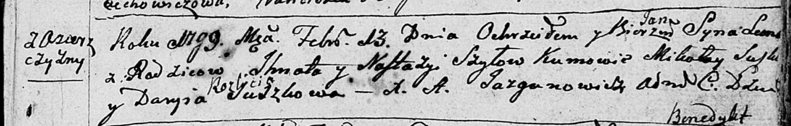

**Сушко Дарыя (Suszkowa Darya)**

21 апреля 1790 г -- крещение сына Тодора (НИАБ 136-13-894, лист 9об,
№25/1790-р (ориг)), (РГИА 823-2-18, лист 239об, №12/1790-р (коп)).

3 февраля 1799 г -- возможно, крестная мать Леона, сына Шил Игната и
Настасьи с деревни Озерщизна (НИАБ 136-13-894, лист 9об, №25/1790-р
(ориг), НИАБ 136-13-938, лист 240об, №8/1799-р (коп)).

**НИАБ 136-13-894:** Лист 9об. **Метрическая запись №25/1790-р (ориг).**

{width="6.496527777777778in"
height="1.1412007874015748in"}

Дедиловичская Покровская церковь. 21 апреля 1790 года. Метрическая
запись о крещении.

Suszko Teodor -- сын родителей с деревни Разлитье.

Suszko Łukjan -- отец.

Suszkowa Darya -- мать.

Suszko Sciepan - кум.

Bautrukowa Małania - кума.

Jazgunowicz Antoni -- ксёндз.

**РГИА 823-2-18:** Лист 239об. **Метрическая запись №12/1790-р (коп).**

{width="6.496527777777778in"
height="1.4465277777777779in"}

Дедиловичская Покровская церковь. 21 апреля 1790 года. Метрическая
запись о крещении.

Suszko Teodor -- сын родителей с деревни Разлитье.

Suszko Łukjan -- отец.

Suszko Darija -- мать.

Suszko Sciepan -- кум.

Bawtrukowa Małania - кума.

Jazgunowicz Antoni -- ксёндз.

**НИАБ 136-13-894:** Лист 38. **Метрическая запись №8/1799-р (ориг).**

{width="6.496527777777778in"
height="1.0419652230971128in"}

Дедиловичская Покровская церковь. 13 февраля 1799 года. Метрическая
запись о крещении.

Szyło Leon Jan -- сын родителей с деревни Озерщизна.

Szyło Jhnat -- отец.

Szyłowa Nastazyja -- мать.

Suszko Mikołay -- кум.

Suszkowa Daryia -- кума с деревни Разлитье.

Jazgunowicz Antoni -- ксёндз.

**НИАБ 136-13-938:** Лист 240об. **Метрическая запись №8/1799-р (коп).**

(См. тж. НИАБ 136-13-894, лист 38, №8/1799-р (ориг); РГИА 823-2-18, лист
268об, №8/1799-р (коп))

{width="6.496527777777778in"
height="1.5666666666666667in"}

Дедиловичская Покровская церковь. 13 февраля 1799 года. Метрическая
запись о крещении.

Szyło Leon Jan -- сын родителей с деревни Озерщизна.

Szyło Jgnat -- отец.

Szyłowa Nastazija -- мать.

Suszko Mikołay -- кум, с деревни Горелое.

Suszkowa Darya - кума, с деревни Разлитье.

Jazgunowicz Antoni -- ксёндз.
