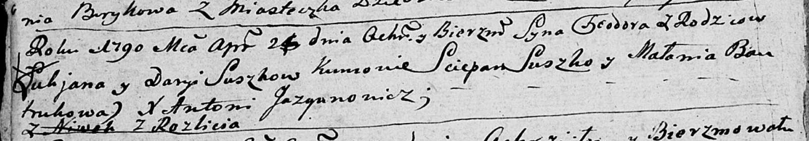
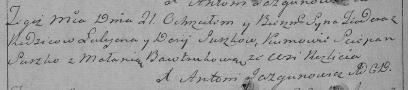

**Сушко Лукьян (Suszko Łukjan)**

21 апреля 1790 г -- крещение сына Тодора (НИАБ 136-13-894, лист 9об,
№25/1790-р (ориг)), (РГИА 823-2-18, лист 239об, №12/1790-р (коп)).

**НИАБ 136-13-894:** Лист 9об. **Метрическая запись №25/1790-р (ориг).**

Дедиловичская Покровская церковь. 21 апреля 1790 года. Метрическая
запись о крещении.

Suszko Teodor -- сын родителей с деревни Разлитье.

Suszko Łukjan -- отец.

Suszkowa Darya -- мать.

Suszko Sciepan - кум.

Bautrukowa Małania - кума.

Jazgunowicz Antoni -- ксёндз.

**РГИА 823-2-18:** Лист 239об. **Метрическая запись №12/1790-р (коп).**

Дедиловичская Покровская церковь. 21 апреля 1790 года. Метрическая
запись о крещении.

Suszko Teodor -- сын родителей с деревни Разлитье.

Suszko Łukjan -- отец.

Suszko Darija -- мать.

Suszko Sciepan -- кум.

Bawtrukowa Małania - кума.

Jazgunowicz Antoni -- ксёндз.
