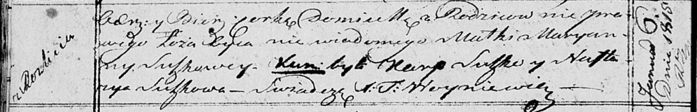

**Сушко Домицеля (Suszkowna Domicela)**

6 января 1815 г -- крещение (НИАБ 136-13-894, лист 91об, №3/1815-р
(ориг)).

**НИАБ 136-13-894:** Лист 91об. **Метрическая запись №3/1815-р (ориг).**

Осовская Покровская церковь. 6 января 1815 года. Метрическая запись о
крещении.

Domicela -- незаконнорожденная дочь, деревня Разлитье.

Suszkowa Maryanna -- мать.

Suszko Karp -- кум.

Suszkowa Nastazia -- кума.

Woyniewicz Tomasz -- ксёндз.
