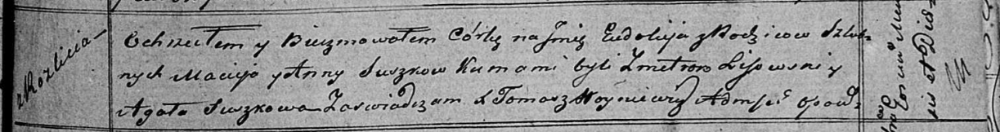

**Сушко Евдокия Мацеева (Suszkowna Eudokija)**

12 октября 1819 г -- крещение (НИАБ 136-13-894, лист 103, №57/1819-р
(ориг)).

**НИАБ 136-13-894:** Лист 103. **Метрическая запись №57/1819-р (ориг).**

Осовская Покровская церковь. 12 октября 1819 года. Метрическая запись о
крещении.

Suszkowna Eudokija -- дочь родителей с деревни Разлитье.

Suszko Maciey -- отец.

Suszkowa Anna -- мать.

Lisowski Zmitrok -- кум.

Suszkowa Agata -- кума.

Woyniewicz Tomasz -- ксёндз.
