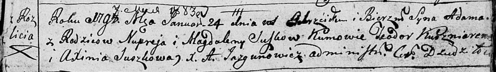
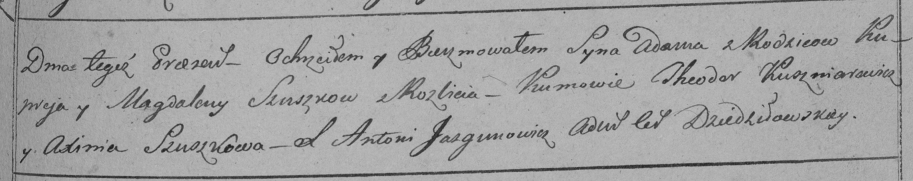

**Сушко Адам Нупреев (Suszko Adam)**

24 января 1798 г -- крещение (НИАБ 136-13-894, лист 35, №5/1798-р
(ориг)), (РГИА 823-2-18, лист 262, №5/1798-р (коп)).

Лист 35. **Метрическая запись №5/1798-р (ориг).**

Дедиловичская Покровская церковь. 24 января 1798 года. Метрическая
запись о крещении.

Suszko Adam -- сын родителей с деревни Разлитье.

Suszko Nuprey -- отец.

Suszkowa Magdalena -- мать.

Kuszniarewicz Teodor - кум.

Suszkowa Axinia - кума.

Jazgunowicz Antoni -- ксёндз.

**РГИА 823-2-18:** Лист 262. **Метрическая запись №5/1798-р (коп).**

Дедиловичская Покровская церковь. 24 января 1798 года. Метрическая
запись о крещении.

Szuszko Adam -- сын родителей с деревни Разлитье.

Szuszko Nupriey -- отец.

Szuszkowa Magdalena -- мать.

Kuszniarewicz Theodor -- кум.

Szuszkowa Axinia -- кума.

Jazgunowicz Antoni -- ксёндз.
