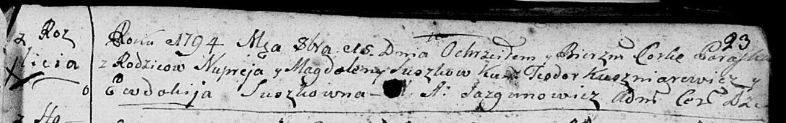

**Сушко Катерина Нупреева (Suszkowna Katarzyna)**

8 января 1788 г -- крещение (НИАБ 136-13-894, лист 3об, №5/1788-р
(ориг)).

**НИАБ 136-13-894:** Лист 3об. **Метрическая запись №5/1788-р (ориг).**

{width="6.496527777777778in"
height="1.093594706911636in"}

Дедиловичская Покровская церковь. 8 января 1788 года. Метрическая запись
о крещении.

Suszkowna Katarzyna -- дочь родителей с деревни Разлитья.

Suszko Nuprej -- отец.

Suszkowa Magdalena -- мать.

Kuszniarewicz Teodor - кум.

Suszkowa Taciana - кума.

Jazgunowicz Antoniusz -- ксёндз.
