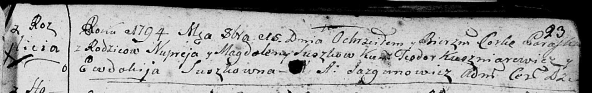

**Сушко Магдалена (Suszkowa Magdalena, Magdusia)**

8 января 1788 г -- крещение дочери Катерины (НИАБ 136-13-894, лист 3об,
№5/1788-р (ориг)).

2 июня 1790 г -- крещение дочери Маруты? (НИАБ 136-13-894, лист 9об,
№33/1790-р (ориг)).

15 октября 1794 г -- крещение дочери Параски (НИАБ 136-13-894, лист 23,
№43/1794-р (ориг)).

24 января 1798 г -- крещение сына Адама (НИАБ 136-13-894, лист 35,
№5/1798-р (ориг)), (РГИА 823-2-18, лист 262, №5/1798-р (коп)).

12 января 1800 г -- крестная мать Иосифа Яна, сына Сушков Гарасима и
Марьяны с деревни Разлитье (НИАБ 136-13-894, лист 40об, №5/1800-р (коп),
НИАБ 136-13-949, лист 101, №5/1800-р (коп)).

20 февраля 1802 г -- крещение сына Самуэля Антона (НИАБ 136-13-894, лист
45об, №5/1802-р (ориг)).

24 июля 1804 г -- крестная мать Сымона Фомы, сына Чапляев Яна и Грыпины
с деревни Отруб (НИАБ 136-13-894, лист 50, №12/1803-р (ориг)).

19 мая 1807 г -- крещение дочери Тодоры Елисаветы (НИАБ 136-13-894, лист
62об, №26/1807-р (ориг)).

25 апреля 1813 г -- отпевание, умерла в возрасте 70 лет (родилась около
1743 г) (НИАБ 136-13-919, лист 27, №42/1813-у (ориг)).

**НИАБ 136-13-894:** Лист 3об. **Метрическая запись №5/1788-р (ориг).**

{width="6.496527777777778in"
height="1.093594706911636in"}

Дедиловичская Покровская церковь. 8 января 1788 года. Метрическая запись
о крещении.

Suszkowna Katarzyna -- дочь родителей с деревни Разлитья.

Suszko Nuprej -- отец.

Suszkowa Magdalena -- мать.

Kuszniarewicz Teodor - кум.

Suszkowa Taciana - кума.

Jazgunowicz Antoniusz -- ксёндз.

**НИАБ 136-13-894:** Лист 9об. **Метрическая запись №33/1790-р (ориг).**

{width="6.496527777777778in"
height="1.2578685476815399in"}

Дедиловичская Покровская церковь. 2 июня 1790 года. Метрическая запись о
крещении.

Suszkowna Maruta? -- дочь родителей с деревни Разлитье.

Suszko Nuprej -- отец.

Suszkowa Magdalena -- мать.

Kuszniarewicz Teodor - кум.

Suszkowna Ewdokija - кума.

Jazgunowicz Antoni -- ксёндз.

**НИАБ 136-13-894:** Лист 23. **Метрическая запись №43/1794-р (ориг).**

{width="6.496527777777778in"
height="1.0218503937007875in"}

Дедиловичская Покровская церковь. 15 октября 1794 года. Метрическая
запись о крещении.

Suszkowna Paraska -- дочь родителей с деревни Разлитье.

Suszko Nuprey -- отец.

Suszkowa Magdalena -- мать.

Kuszniarewicz Teodor - кум.

Suszkowna Ewdokija - кума.

Jazgunowicz Antoni -- ксёндз.

Лист 35. **Метрическая запись №5/1798-р (ориг).**

{width="6.496527777777778in"
height="0.9494356955380577in"}

Дедиловичская Покровская церковь. 24 января 1798 года. Метрическая
запись о крещении.

Suszko Adam -- сын родителей с деревни Разлитье.

Suszko Nuprey -- отец.

Suszkowa Magdalena -- мать.

Kuszniarewicz Teodor - кум.

Suszkowa Axinia - кума.

Jazgunowicz Antoni -- ксёндз.

**РГИА 823-2-18:** Лист 262. **Метрическая запись №5/1798-р (коп).**

{width="6.496527777777778in"
height="1.2881944444444444in"}

Дедиловичская Покровская церковь. 24 января 1798 года. Метрическая
запись о крещении.

Szuszko Adam -- сын родителей с деревни Разлитье.

Szuszko Nupriey -- отец.

Szuszkowa Magdalena -- мать.

Kuszniarewicz Theodor -- кум.

Szuszkowa Axinia -- кума.

Jazgunowicz Antoni -- ксёндз.

**НИАБ 136-13-894:** Лист 40об. **Метрическая запись №5/1800-р (ориг).**

{width="6.496527777777778in"
height="1.906917104111986in"}

Дедиловичская Покровская церковь. 12 января 1800 года. Метрическая
запись о крещении.

Suszko Jozef Jan -- сын родителей с деревни Разлитье.

Suszko Harasim -- отец.

Suszkowa Marjana -- мать.

Sawicki Michał -- кум, с деревни Дедиловичи.

Suszkowa Magdalena -- кума, с деревни Разлитье.

Jazgunowicz Antoni -- ксёндз.

**НИАБ 136-13-949:** Лист 101. **Метрическая запись №5/1800-р (коп).**

(См. тж.: РГИА 823-2-18, лист 274об, №5/1800-р (коп), НИАБ 136-13-894,
лист 40об, №5/1800-р (ориг))

{width="6.496527777777778in"
height="2.1284722222222223in"}

Дедиловичская Покровская церковь. 12 февраля 1800 года. Метрическая
запись о крещении.

Suszko Jozef Jan -- сын родителей с деревни Разлитье.

Suszko Harasim -- отец.

Suszkowa Marjana -- мать.

Savicki Michał -- кум, с деревни Дедиловичи.

Suszkowa Magdalena - кума, с деревни Разлитье.

Jazgunowicz Antoni -- ксёндз.

**НИАБ 136-13-894:** Лист 45об. **Метрическая запись №5/1802-р (ориг).**

{width="6.496527777777778in"
height="1.3571030183727033in"}

Дедиловичская Покровская церковь. 20 февраля 1802 года. Метрическая
запись о крещении.

Suszko Samuel Antoni -- сын родителей \[с деревни Разлитье\].

Suszko Onufry -- отец.

Suszkowa Magdalena -- мать.

Kuszniarewicz Teodor -- кум.

Suszkowa Xienia -- кума.

Jazgunowicz Antoni -- ксёндз.

**НИАБ 136-13-894:** Лист 54. **Метрическая запись №25/1804-р (ориг).**

{width="6.496527777777778in"
height="1.7936023622047244in"}

Дедиловичская Покровская церковь. 24 июля 1804 года. Метрическая запись
о крещении.

Czaplay Symon Tomasz -- сын родителей с деревни Отруб.

Czaplay Januś -- отец.

Czaplaiowa Hrypina -- мать.

Suszko Łukian -- кум, с деревни Горелое.

Suszkowa Magdalena -- кума, с деревни Разлитье.

Jazgunowicz Antoni -- ксёндз.

**НИАБ 136-13-894:** Лист 62об. **Метрическая запись №26/1807-р
(ориг).**

{width="6.496527777777778in"
height="1.1881353893263342in"}

Дедиловичская Покровская церковь. 19 мая 1807 года. Метрическая запись о
крещении.

Suszkowa Todora Elżbieta -- дочь родителей с деревни Разлитье.

Suszko Nuprey -- отец.

Suszkowa Magdusia -- мать.

Kuszniarewicz Todor -- кум, с деревни Дедиловичи.

Suszkowa Marya -- кума, с деревни Разлитье.

Jazgunowicz Antoni -- ксёндз.

**НИАБ 136-13-919:** Лист 27. **Метрическая запись №42/1813-у (ориг).**

{width="6.496527777777778in"
height="1.1784722222222221in"}

Осовская униатская церковь. 25 апреля 1813 года. Метрическая запись об
отпевании.

Suszkowa Magdalena -- умершая, 70 лет, с деревни Разлитье, похоронена на
кладбище деревни Разлитье.

Woyniewicz Tomasz -- ксёндз.
