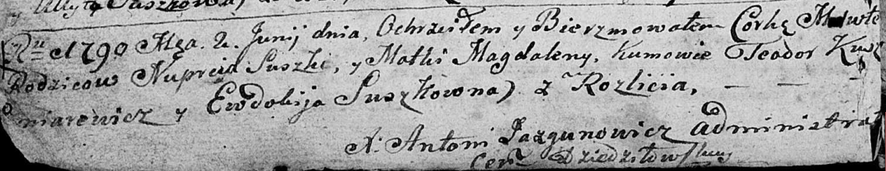

**Сушко Марута? Нупреева (Suszkowna Maruta?)**

2 июня 1790 г -- крещение (НИАБ 136-13-894, лист 9об, №33/1790-р
(ориг)).

**НИАБ 136-13-894:** Лист 9об. **Метрическая запись №33/1790-р (ориг).**

Дедиловичская Покровская церковь. 2 июня 1790 года. Метрическая запись о
крещении.

Suszkowna Maruta? -- дочь родителей с деревни Разлитье.

Suszko Nuprej -- отец.

Suszkowa Magdalena -- мать.

Kuszniarewicz Teodor - кум.

Suszkowna Ewdokija - кума.

Jazgunowicz Antoni -- ксёндз.
