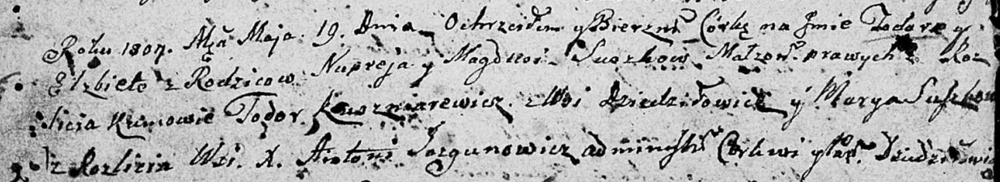

**Сушко Тодора Нупреева (Suszkowna Todora Elżbieta)**

19 мая 1807 г -- крещение (НИАБ 136-13-894, лист 62об, №26/1807-р
(ориг)).

**НИАБ 136-13-894:** Лист 62об. **Метрическая запись №26/1807-р
(ориг).**

Дедиловичская Покровская церковь. 19 мая 1807 года. Метрическая запись о
крещении.

Suszkowa Todora Elżbieta -- дочь родителей с деревни Разлитье.

Suszko Nuprey -- отец.

Suszkowa Magdusia -- мать.

Kuszniarewicz Todor -- кум, с деревни Дедиловичи.

Suszkowa Marya -- кума, с деревни Разлитье.

Jazgunowicz Antoni -- ксёндз.
