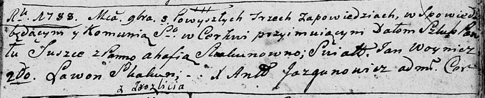

**Сушко Агафия (Suszkowa Ahafia z Skakunow)**

3 ноября 1788 г -- венчание с Павлом Сушко (НИАБ 136-13-894, лист 67,
№11/1788-б (ориг)).

**НИАБ 136-13-894:** Лист 67. **Метрическая запись №11/1788-б (ориг).**

Дедиловичская Покровская церковь. 3 ноября 1788 года. Метрическая запись
о венчании.

Suszko Paweł -- жених, с деревни Разлитье.

Skakunowna Ahafia -- невеста.

Woynicz Jan -- свидетель.

Skakun Lawon -- свидетель.

Jazgunowicz Antoni -- ксёндз.
