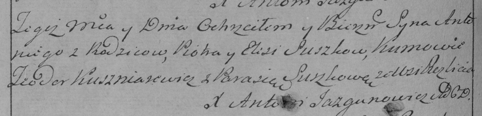

**Сушко Антон Петров (Suszko Antoni)**

18 января 1797 г -- крещение (НИАБ 136-13-894, лист 32, №6/1797-р
(ориг)), (РГИА 823-2-18, лист 258об, №6/1797-р (коп)).

**НИАБ 136-13-894:** Лист 32. **Метрическая запись №6/1797-р (ориг).**

{width="6.496527777777778in"
height="1.0332491251093614in"}

Дедиловичская Покровская церковь. 18 января 1797 года. Метрическая
запись о крещении.

Suszko Antoni -- сын родителей с деревни Разлитье.

Suszko Piotr -- отец.

Suszkowa Elesia -- мать.

Kuszniarewicz Teodor - кум.

Suszkowa Parasia - кума.

Jazgunowicz Antoni -- ксёндз.

**РГИА 823-2-18:** Лист 258об. **Метрическая запись №6/1797-р (коп).**

{width="6.496527777777778in"
height="1.5680555555555555in"}

Дедиловичская Покровская церковь. 18 января 1797 года. Метрическая
запись о крещении.

Suszko Antoni -- сын родителей с деревни Разлитье.

Suszko Piotr -- отец.

Suszkowa Elesia -- мать.

Kuszniarewicz Teodor -- кум.

Suszkowa Parasia -- кума.

Jazgunowicz Antoni -- ксёндз.
