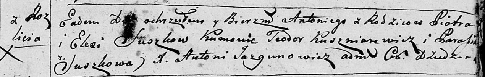
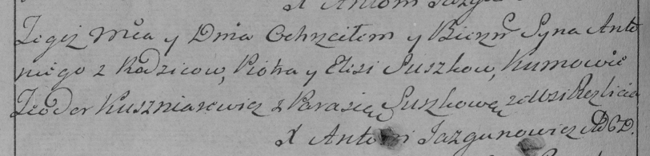
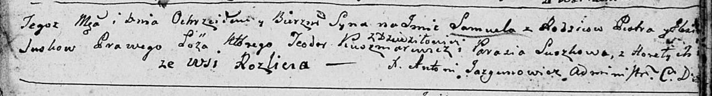
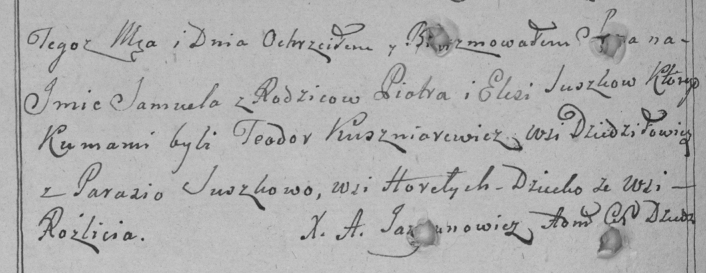

**Сушко Пётр (Suszko Piotr)**

18 января 1797 г -- крещение сына Антона (НИАБ 136-13-894, лист 32,
№6/1797-р (ориг)), (РГИА 823-2-18, лист 258об, №6/1797-р (коп)).

23 октября 1799 г -- крещение сына Самуэля (НИАБ 136-13-894, лист 40,
№43/1799-р (ориг)), (РГИА 823-2-18, лист 272об, №42/1799-р (коп)).

**НИАБ 136-13-894:** Лист 32. **Метрическая запись №6/1797-р (ориг).**

Дедиловичская Покровская церковь. 18 января 1797 года. Метрическая
запись о крещении.

Suszko Antoni -- сын родителей с деревни Разлитье.

Suszko Piotr -- отец.

Suszkowa Elesia -- мать.

Kuszniarewicz Teodor - кум.

Suszkowa Parasia - кума.

Jazgunowicz Antoni -- ксёндз.

**РГИА 823-2-18:** Лист 258об. **Метрическая запись №6/1797-р (коп).**

Дедиловичская Покровская церковь. 18 января 1797 года. Метрическая
запись о крещении.

Suszko Antoni -- сын родителей с деревни Разлитье.

Suszko Piotr -- отец.

Suszkowa Elesia -- мать.

Kuszniarewicz Teodor -- кум.

Suszkowa Parasia -- кума.

Jazgunowicz Antoni -- ксёндз.

Лист 40. **Метрическая запись №43/1799-р (ориг).**

Дедиловичская Покровская церковь. 23 октября 1799 года. Метрическая
запись о крещении.

Suzsko Samuel -- сын родителей с деревни Разлитье.

Suzsko Piotr -- отец.

Suzsko Elżbieta -- мать.

Kuszniarewicz Teodor -- кум, с деревни Дедиловичи.

Suszkowa Parasia -- кума, с деревня Горелое.

Jazgunowicz Antoni -- ксёндз.

**РГИА 823-2-18:** Лист 272об. **Метрическая запись №42/1799-р (коп).**

Дедиловичская Покровская церковь. 23 октября 1799 года. Метрическая
запись о крещении.

Suszko Samuel -- сын родителей с деревни Разлитье.

Suszko Piotr -- отец.

Suszkowa Elesia \[Elżbieta\] -- мать.

Kuszniarewicz Teodor -- кум, с деревни Дедиловичи.

Suszkowa Parasia -- кума, с деревни Горелое.

Jazgunowicz Antoni -- ксёндз.
