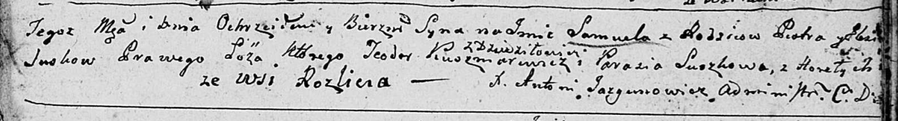
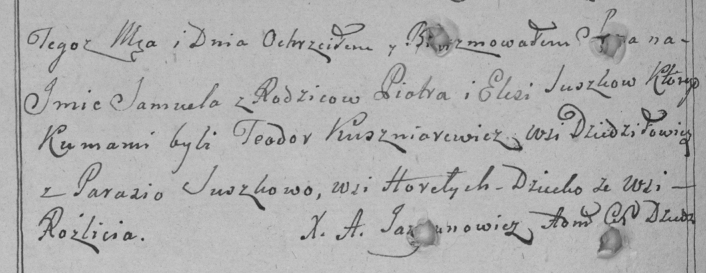

**Сушко Самуэль Петров (Suszko Samuel)**

23 октября 1799 г -- крещение (НИАБ 136-13-894, лист 40, №43/1799-р
(ориг)), (РГИА 823-2-18, лист 272об, №42/1799-р (коп)).

Лист 40. **Метрическая запись №43/1799-р (ориг).**

Дедиловичская Покровская церковь. 23 октября 1799 года. Метрическая
запись о крещении.

Suzsko Samuel -- сын родителей с деревни Разлитье.

Suzsko Piotr -- отец.

Suzsko Elżbieta -- мать.

Kuszniarewicz Teodor -- кум, с деревни Дедиловичи.

Suszkowa Parasia -- кума, с деревня Горелое.

Jazgunowicz Antoni -- ксёндз.

**РГИА 823-2-18:** Лист 272об. **Метрическая запись №42/1799-р (коп).**

Дедиловичская Покровская церковь. 23 октября 1799 года. Метрическая
запись о крещении.

Suszko Samuel -- сын родителей с деревни Разлитье.

Suszko Piotr -- отец.

Suszkowa Elesia \[Elżbieta\] -- мать.

Kuszniarewicz Teodor -- кум, с деревни Дедиловичи.

Suszkowa Parasia -- кума, с деревни Горелое.

Jazgunowicz Antoni -- ксёндз.
