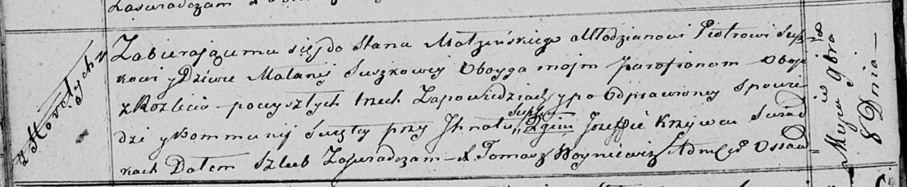

**Сушко (в девичестве Сушко) Маланья (Suszkowa Małanija z Suszkow)**

8 ноября 1819 г -- венчание с молодым Петром Сушко с деревни Разлитье
(НИАБ 136-13-920, лист 26об, №11/1819-б (ориг)).

**НИАБ 136-13-920:** Лист 26об. **Метрическая запись №11/1819-б
(ориг).**

{width="6.496527777777778in"
height="1.3450339020122484in"}

Осовская Покровская церковь. 8 ноября 1819 года. Запись о венчании.

Suszko Piotr -- жених, молодой, парафии Осовской, с деревни Разлитье.

Suszkowa Malanija -- невеста, девка, парафии Осовской, с деревни
Разлитье.

Suszko Jhnat -- свидетель.

Krzywec Jozef -- свидетель.

Woyniewicz Tomasz -- ксёндз.
