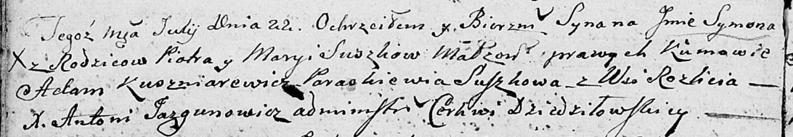
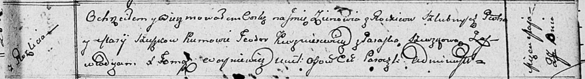
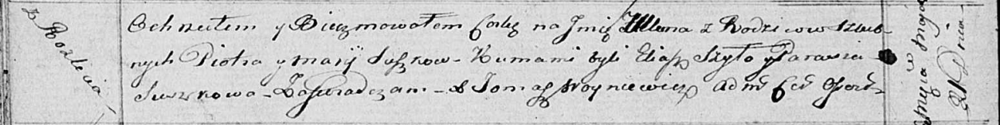
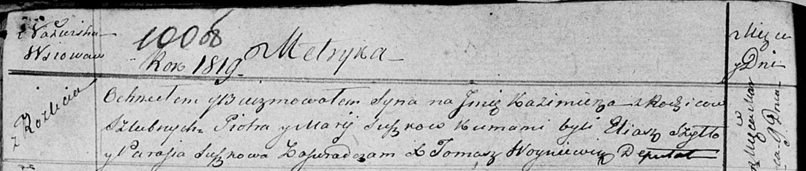
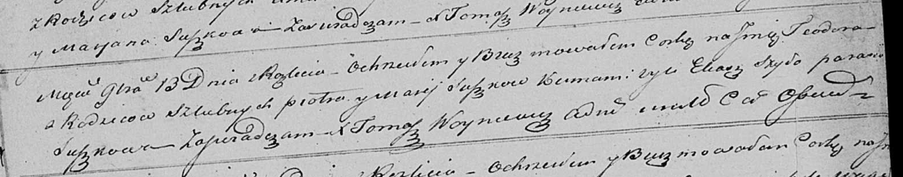

**Сушко Пётр (Suszko Piotr)**

23 октября 1804 г -- крещение дочери Катерины Дарыи (НИАБ 136-13-894,
лист 54, №49/1804-р (ориг)).

22 июля 1806 г -- крещение сына Сымона (НИАБ 136-13-894, лист 60об,
№33/1806-р (ориг)).

27 мая 1811 г -- крещение дочери Зеновии (НИАБ 136-13-894, лист 81,
№27/1811-р (ориг)).

21 мая 1816 г -- крещение дочери Ульяны (НИАБ 136-13-894, лист 93об,
№11/1816-р (ориг)).

9 марта 1819 г -- крещение сына Казимира (НИАБ 136-13-894, лист 100об,
№10/1819-р (ориг)).

13 ноября 1821 г -- крещение дочери Тодоры (НИАБ 136-13-894, лист 107об,
№51/1821-р (ориг)).

**НИАБ 136-13-894:** Лист 55. **Метрическая запись №49/1804-р (ориг).**

Дедиловичская Покровская церковь. 23 октября 1804 года. Метрическая
запись о крещении.

Suszkowna Katerzyna Daryia -- дочь родителей с деревни Разлитье.

Suszko Piotr -- отец.

Suszkowa Maryia -- мать.

Kuszniarewicz Teodor -- кум.

Suszkowa Parasia -- кума.

Jazgunowicz Antoni -- ксёндз.

**НИАБ 136-13-894:** Лист 60об. **Метрическая запись №33/1806-р
(ориг).**

Дедиловичская Покровская церковь. 22 июля 1806 года. Метрическая запись
о крещении.

Suszko Symon -- сын родителей с деревни Разлитье.

Suszko Piotr -- отец.

Suszkowa Marya -- мать.

Kuszniarewicz Adam -- кум.

Suszkowa Paraskiewia -- кума.

Jazgunowicz Antoni -- ксёндз.

**НИАБ 136-13-894:** Лист 81. **Метрическая запись №27/1811-р (ориг).**

Осовская Покровская церковь. 27 мая 1811 года. Метрическая запись о
крещении.

Szuszkowna Zienowia -- дочь родителей с деревни Разлитье.

Szuszko Piotr -- отец.

Szuszkowa Marija -- мать.

Kuszniarewicz Teodor -- кум.

Szuszkowa Paraska -- кума.

Woyniewicz Tomasz -- ксёндз.

**НИАБ 136-13-894:** Лист 93об. **Метрическая запись №11/1816-р
(ориг).**

Осовская Покровская церковь. 21 мая 1816 года. Метрическая запись о
крещении.

Suszkowna Ullana -- дочь родителей с деревни Разлитье.

Suszko Piotr -- отец.

Suszkowa Marija -- мать.

Szyło Eliasz -- кум.

Suszkowa Parasia -- кума.

Woyniewicz Tomasz -- ксёндз.

**НИАБ 136-13-894:** Лист 100об. **Метрическая запись №10/1819-р
(ориг).**

Осовская Покровская церковь. 9 марта 1819 года. Метрическая запись о
крещении.

Suszko Kazimierz -- сын родителей с деревни Разлитье.

Suszko Piotr -- отец.

Suszko Maria -- мать.

Szyło Eliasz -- кум.

Suszkowa Parasia -- кума.

Woyniewicz Tomasz -- ксёндз.

**НИАБ 136-13-894:** Лист 107об. **Метрическая запись №51/1821-р
(ориг).**

Осовская Покровская церковь. 13 ноября 1821 года. Метрическая запись о
крещении.

Suszkowna Teodora -- дочь родителей с деревни Разлитье.

Suszko Piotr -- отец.

Suszkowa Marija -- мать.

Szyło Eliasz -- кум.

Suszkowa Parasia -- кума.

Woyniewicz Tomasz -- ксёндз.
