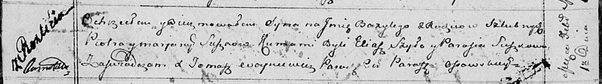

**Сушко Пётр (Suszko Piotr)**

1 февраля 1814 г -- крещение сына Базылия (НИАБ 136-13-894, лист 88об,
№8/1814-р (ориг)).

**НИАБ 136-13-894:** Лист 88об. **Метрическая запись №8/1814-р (ориг).**

{width="6.496527777777778in"
height="0.915239501312336in"}

Осовская Покровская церковь. 1 февраля 1814 года. Метрическая запись о
крещении.

Suszko Bazyli -- сын родителей с деревни Разлитье.

Suszko Piotr -- отец.

Suszkowa Marjana -- мать.

Szyło Eliasz -- кум.

Suszkowa Parasia -- кума.

Woyniewicz Tomasz -- ксёндз.
