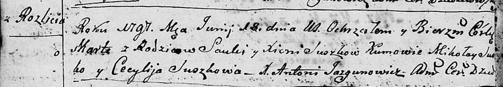

**Сушко Изыдор Савов (Suszko Jzydor Stefan)**

27 декабря 1804 г -- крещение (НИАБ 136-13-894, лист 56, №62/1804-р
(ориг)).

**НИАБ 136-13-894:** Лист 56. **Метрическая запись №62/1804-р (ориг).**

{width="6.496527777777778in"
height="0.7523075240594925in"}

Дедиловичская Покровская церковь. 27 декабря 1804 года. Метрическая
запись о крещении.

Suszko Jzydor Stefan -- сын родителей с деревни Разлитье.

Suszko Sawa -- отец.

Suszkowa Xienia -- мать.

Suszko Mikołay -- кум.

Suszkowa Cecylija -- кума.

Jazgunowicz Antoni -- ксёндз.
