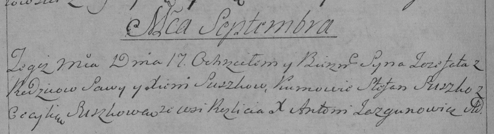

**Сушко Иозефат Савов (Suszko Jozefat)**

11 сентября 1794 г -- крещение (НИАБ 136-13-894, лист 22об, №37/1794-р
(ориг)), (РГИА 823-2-18, лист 250об, №27/1794-р (коп)).

**НИАБ 136-13-894:** Лист 22об. **Метрическая запись №37/1794-р
(ориг).**

Дедиловичская Покровская церковь. 11 сентября 1794 года. Метрическая
запись о крещении.

Suszko Jozefat -- сын родителей с деревни Разлитье.

Suszko Sawa -- отец.

Suszkowa Xienia -- мать.

Suszko Stefan - кум.

Suszkowa Cecylija - кума.

Jazgunowicz Antoni -- ксёндз.

**РГИА 823-2-18:** Лист 250об. **Метрическая запись №27/1794-р (коп).**

Дедиловичская Покровская церковь. 17 сентября 1794 года. Метрическая
запись о крещении.

Suszko Jozefat -- сын родителей с деревни Разлитье.

Suszko Sawa -- отец.

Suszkowa Xienia -- мать.

Suszko Stefan -- кум.

Suszkowa Cecylia -- кума.

Jazgunowicz Antoni -- ксёндз.
