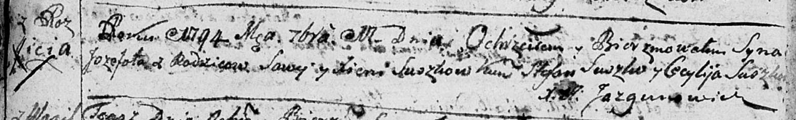
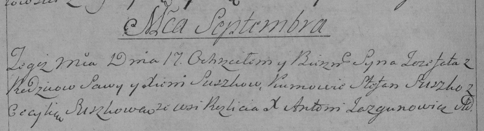

**Сушко Сава (Suszko Sawa, Sauka, Sawka)**

7 ноября 1787 г -- венчание с Ксеней Стальмах (НИАБ 136-13-894, лист 66,
№7/1787-б (ориг)).

4 марта 1789 г -- крещение дочери Елены (НИАБ 136-13-894, лист 6об,
№14/1789-р (ориг)).

11 сентября 1794 г -- крещение сына Иозефата (НИАБ 136-13-894, лист
22об, №37/1794-р (ориг)), (РГИА 823-2-18, лист 250об, №27/1794-р (коп)).

18 июня 1797 г -- крещение дочери Марты (НИАБ 136-13-894, лист 33об,
№39/1797-р (ориг)).

29 марта 1800 г -- крещение сына Францишка Иосифа (НИАБ 136-13-894, лист
41, №11/1800-р (ориг), РГИА 823-2-18, лист 275, №11/1800-р (коп), НИАБ
136-13-949, лист 101об, №11/1800-р (коп)).

2 июня 1802 г -- крещение сына Юстына (НИАБ 136-13-894, лист 46об,
№19/1802-р (ориг)).

27 декабря 1804 г -- крещение сына Изыдора Стефана (НИАБ 136-13-894,
лист 56, №62/1804-р (ориг)).

12 мая 1807 г -- крещение сына Хведора (НИАБ 136-13-894, лист 62об,
№25/1807-р (ориг)).

**НИАБ 136-13-894:** Лист 66. **Метрическая запись №7/1787-б (ориг).**

Дедиловичская Покровская церковь. 7 ноября 1787 года. Метрическая запись
о венчании.

Suszko Sawka -- жених с деревни \[Разлитье\].

Stalmachowna Xienia -- невеста.

Suszko Leon -- свидетель.

Suszko Alisiey -- свидетель.

Jazgunowicz Antoni -- ксёндз.

**НИАБ 136-13-894:** Лист 66об. **Метрическая запись №17/1787-б
(ориг).** (см.тж. Лист 66 №7)

Дедиловичская Покровская церковь. 14 ноября 1787 года. Метрическая
запись о венчании.

Suszko Sawka -- жених.

Stelmachowna Xienia -- невеста.

Suszko Cimoch -- свидетель.

Jsay Samuś -- свидетель.

Jazgunowicz Antoni -- ксёндз.

**НИАБ 136-13-894:** Лист 6об. **Метрическая запись №14/1789-р (ориг).**

Дедиловичская Покровская церковь. 4 марта 1789 года. Метрическая запись
о крещении.

Suszkowna Elena -- дочь родителей с деревни Разлитье.

Suszko Sawa -- отец.

Suszkowa Xienia -- мать.

Suszko Mikołay - кум.

Suszkowa Taciana - кума.

Jazgunowicz Antoni -- ксёндз.

**НИАБ 136-13-894:** Лист 22об. **Метрическая запись №37/1794-р
(ориг).**

Дедиловичская Покровская церковь. 11 сентября 1794 года. Метрическая
запись о крещении.

Suszko Jozefat -- сын родителей с деревни Разлитье.

Suszko Sawa -- отец.

Suszkowa Xienia -- мать.

Suszko Stefan - кум.

Suszkowa Cecylija - кума.

Jazgunowicz Antoni -- ксёндз.

**РГИА 823-2-18:** Лист 250об. **Метрическая запись №27/1794-р (коп).**

Дедиловичская Покровская церковь. 17 сентября 1794 года. Метрическая
запись о крещении.

Suszko Jozefat -- сын родителей с деревни Разлитье.

Suszko Sawa -- отец.

Suszkowa Xienia -- мать.

Suszko Stefan -- кум.

Suszkowa Cecylia -- кума.

Jazgunowicz Antoni -- ксёндз.

**НИАБ 136-13-894:** Лист 33об. **Метрическая запись №39/1797-р
(ориг).**

Дедиловичская Покровская церковь. 18 июня 1797 года. Метрическая запись
о крещении.

Suszkowna Marta -- дочь родителей с деревни Разлитье.

Suszko Sauka -- отец.

Suszkowa Xienia -- мать.

Suszko Mikołay - кум.

Suszkowa Cecylija - кума.

Jazgunowicz Antoni -- ксёндз.

**НИАБ 136-13-894:** Лист 41. **Метрическая запись №11/1800-р (ориг).**

Дедиловичская Покровская церковь. 29 марта 1800 года. Метрическая запись
о крещении.

Suszkowa Franciszek Jozef -- сын родителей с деревни Разлитье.

Suszko Sawka -- отец.

Suszkowa Aksynja -- мать.

Suszko Mikołay -- кум, с деревни Горелое.

Suszkowa Kulina -- кума, с деревни Разлитье.

Jazgunowicz Antoni -- ксёндз.

**РГИА 823-2-18:** Лист 275. **Метрическая запись №11/1800-р (коп).**

Дедиловичская Покровская церковь. 29 марта 1800 года. Метрическая запись
о крещении.

Suszko Franciszek Jozef -- сын родителей с деревни \[Разлитье\].

Suszko Sawka -- отец.

Suszkowa Akwina -- мать.

Suszko Mikołay -- кум, с деревни Горелое.

Suszkowa Kulina -- кума, с деревни Горелое.

Jazgunowicz Antoni -- ксёндз.

**НИАБ 136-13-949:** Лист 101об. **Метрическая запись №11/1800-р
(коп).**

(См. тж.: РГИА 823-2-18, лист 275, №11/1800-р (коп), НИАБ 136-13-894,
лист 41, №11/1800-р (ориг))

Дедиловичская Покровская церковь. 29 марта 1800 года. Метрическая запись
о крещении.

Suszko Jozef Franciszak \[Franciszek Jozef\] -- сын родителей с деревня
Разлитье.

Suszko Sawa -- отец.

Suszkowa Akwiła \[Aksynja\] -- мать.

Suszko Mikołay -- кум, с деревни Горелое.

Suszkowa Kulina - кума, с деревни Горелое \[Разлитье\].

Jazgunowicz Antoni -- ксёндз.

**НИАБ 136-13-894:** Лист 46об. **Метрическая запись №19/1802-р
(ориг).**

Дедиловичская Покровская церковь. 2 июня 1802 года. Метрическая запись о
крещении.

Suszko Justyn -- сын родителей \[с деревни Разалитье\].

Suszko Sawka -- отец.

Suszkowa Xienia -- мать.

Suszko Jakub -- кум.

Suszkowa Cecylija -- кума.

Jazgunowicz Antoni -- ксёндз.

**НИАБ 136-13-894:** Лист 56. **Метрическая запись №62/1804-р (ориг).**

Дедиловичская Покровская церковь. 27 декабря 1804 года. Метрическая
запись о крещении.

Suszko Jzydor Stefan -- сын родителей с деревни Разлитье.

Suszko Sawa -- отец.

Suszkowa Xienia -- мать.

Suszko Mikołay -- кум.

Suszkowa Cecylija -- кума.

Jazgunowicz Antoni -- ксёндз.

**НИАБ 136-13-894:** Лист 62об. **Метрическая запись №25/1807-р
(ориг).**

Дедиловичская Покровская церковь. 12 мая 1807 года. Метрическая запись о
крещении.

Suszko Chwiedor -- сын родителей с деревни Разлитье.

Suszko Sauka -- отец.

Suszkowa Xienia -- мать.

Suszko Jakub -- кум, с деревни Горелое.

Suszkowa Cecylia -- кума, с деревни Горелое.

Jazgunowicz Antoni -- ксёндз.
